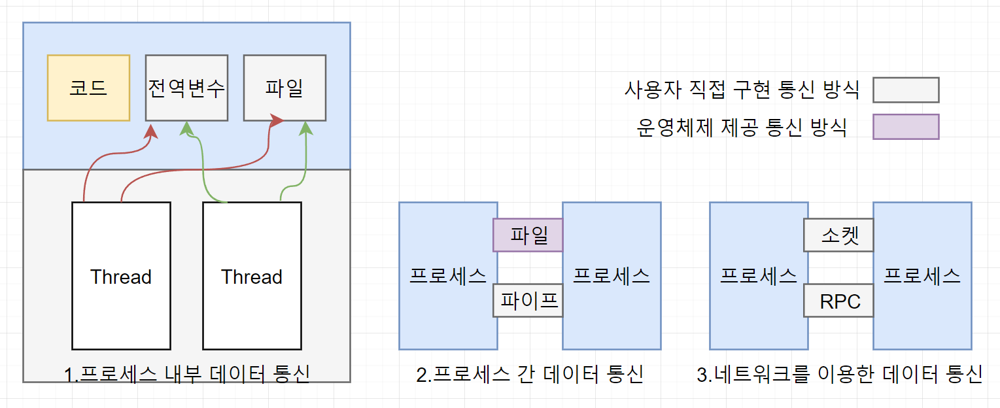

# IPC

- 프로세스 간 통신하는 방법은?
  
  **프로세스 간 통신 : IPC(Inter-Process Communication)**
  → 계산 속도 향상, 편의성 등을 위해 사용
  **프로세스 간 통신의 종류**
  1.  공유 메모리
      · 일정한 크기의 메모리를 프로세스 간에 공유하여 통신하는 방법
      · 프로세스가 공유 메모리 할당을 요청하면 커널이 해당 프로세스에 메모리 공간을 할당
      
  2.  파이프(파일시스템)
      · 버퍼(데이터의 흐름)를 생성하여 통신하는 방법
      · Anonymous PIPE
  - 일반적인 파이프
  - 부모와 자식 프로세스 사이에 사용됨
    · Named PIPE
  - FIFO라 불리는 특수 파일을 이용
  - 서로 관련 없는 프로세스 간 통신에 사용
    
    
  3. 메세지 큐
     · 입출력 방식은 Named PIPE와 동일하지만 데이터의 흐름이 아니라 메모리 공간을 사용
     · 다수의 프로세스 간 메세지 전달 가능
     
  1. 소켓(Socket)
     소켓 : 네트워크상에서 서버와 클라이언트 두 개의 프로그램이 특정 포트를 통해 양방향 통신이 가능하도록 만들어주는 소프트웨어 장치
     · 네트워크 소켓 통신을 통해 데이터 공유
     · 여러 컴퓨터에 있는 프로세스 간 통신
     
     **분류**
  1. 통신 방향에 따른 분류
     · 단반향 : 한쪽으로만 데이터 전송 가능 (파이프)
     · 양방향 : 동시에 양쪽 방향으로 전송 가능 (소켓)
     · 반양방향 : 양쪽으로 전송 가능하지만 동시에는 불가 (무전기)
  1. 통신 구현 방식에 따른 분류
     바쁜 대기(Busy Waiting) : 상대 프로세스가 데이터를 보냈는지 지속적으로 확인하는 것
     → 자원 낭비
     ⇒ 해결 방법 : 동기화(synchronization)
     · 대기가 있는 통신(Blocking, synchronous communication) : 동기화 지원, 데이터가 도착할 때까지 자동으로 대기 상태 유지 (파이프, 소켓)
     · 대기가 없는 통신(Non-Blocking, asynchronous communication) : 동기화 미지원, busy waiting을 사용하여 데이터 도착 여부 직접 확인 (공유 메모리, 파일)
