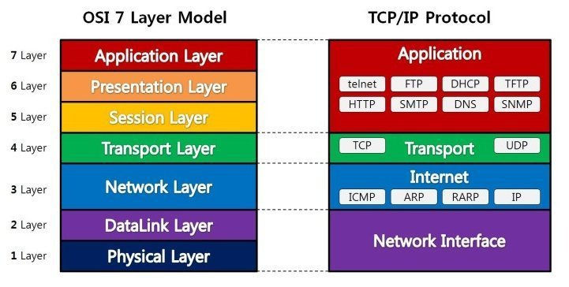
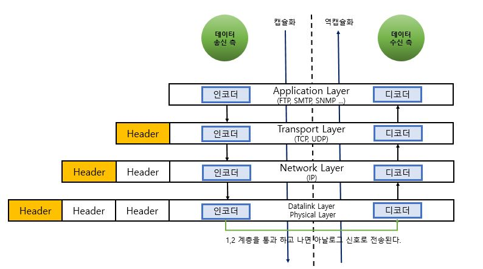

# OSI 7계층에 대해 설명하여라

### OSI 7계층이란

OSI 7 계층 : **네트워크에서 통신이 일어나는 과정을 7단계로 나눈 것**

탄생 배경 : 초기 여러 정보 통신 업체 장비들은 자신의 업체 장비들끼리만 연결이 되어 **호환성**이 없었음
모든 시스템들의 **상호 연결에 있어 문제없도록 표준을 정한 것**이 OSI 7계층

흐름을 한눈에 알아보기 쉽고, 사람들이 이해하기 쉽고, 7단계 중 특정한 곳에 이상이 생기면 다른 단계의 장비 및 소프트웨어를 건드리지 않고 **이상이 생긴 단계만 고칠 수 있음**

- OSI 7계층은 **응용, 표현, 세션, 전송, 네트워크, 데이터 링크, 물리** 계층으로 나뉨
- 각 계층은 **하위 계층을 사용**하고 **현 계층의 기능을 포함하여 상위 계층에 제공**
- **캡슐화** : 전송 시 7계층에서 1계층으로 헤더를 붙임
- **디캡슐화** : 수신 시 1계층에서 7계층으로 헤더를 떼어냄

### 1. 물**리 계층(Physical Layer)**

- 데이터를 **전기 신호**로 바꿔주는 역할
- 네트워크의 **두 노드를 물리적으로 연결**
- 통신 단위는 **비트(0, 1)**
- **단지 데이터를 전달할 뿐** 전송 데이터가 무엇인지, 어떤 에러가 있는지 등에는 전혀 신경 쓰지 않음
- 장비 : **통신 케이블**, **리피터**( 신호가 약해지거나 잡음에 의해 훼손되기 전에 수신하여 신호를 증폭시키는 역할), **허브**(다중 포트의 리피터 역할)

### 2. **데이터 링크 계층(Data-Link Layer)**

- 물리적인 연결을 통하여 **인접한 두 장치 간의 신뢰성 있는 정보 전송**을 담당(**Point-To-Point** 전송)
- **비트 수준의 오류 검출과 정정** 제공(미검출 될 수 있음)
- 데이터 단위는 **프레임(Frame)**
- **MAC 주소**(네트워크 인터페이스에 할당된 고유 식별자)를 통한 통신
- 장비 : **브릿지**(수신한 신호를 재생성하고 물리 계층 및 데이터 링크 계층의 연결 기능, 서로 다른 종류의 네트워크를 연결), **스위치**(물리적 포트에 연결된 기기에서 전송된 패킷을 받아 패킷이 도달해야 하는 기기로 이어지는 포트를 통해서 내보내는 장비)

### 3. **네트워크 계층(Network Layer)**

- 데이터를 **목적지까지 가장 안전하고 빠르게 전달하는 기능**
- **포워딩**(라우터 내부 입력 링크에서 출력 링크)과 **라우팅**(출발 host → 도착 host 경로 설정)
- 데이터 단위는 **패킷(Packet)**
- **IP 주소**를 통한 통신
- 장비 : **라우터**(패킷의 위치를 추출하여, 그 위치에 대한 최적의 경로를 지정하며, 이 경로를 따라 데이터 패킷을 다음 장치로 전달), **L3 스위치**(스위치에 라우팅 기능을 장착한 것)

### 4. **전송 계층(Transport Layer)**

- 양 끝단(End to End) 간 **신뢰성 있고 정확한 데이터 전송**을 담당
- process - process 데이터 전송
- 데이터 전송을 위해서 **Port 번호**를 사용
- 송신자와 수신자 간의 신뢰성 있고 효율적인 데이터를 전송하기 위하여 **오류 검출 및 복구, 흐름 제어와 중복 검사** 등을 수행
- 데이터 단위는 **세그먼트(Segment)**
- 대표적인 프로토콜 : **TCP**, **UDP**

### 5. **세션 계층(Session Layer)**

- **데이터가 통신하기 위한 논리적인 연결**을 제공
- 2대의 기기, 컴퓨터 또는 서버 간에 통신을 하기 위해서는 세션을 만들어야 하는데 이 작업이 여기서 처리
- **세션 설정, 유지, 종료, 전송 중단 시 복구** 등의 기능

### 6. **표현 계층(Presentation Layer)**

- **데이터를 어떻게 표현**할지 정하는 역할을 하는 계층
- 서로 다른 환경의 컴퓨터와 Application들이 서로의 data를 이해 할 수 있도록 도와주는 계층
- 응용프로그램 형식을 준비 또는 네트워크 형식으로 변환하거나 네트워크 형식을 응용프로그램 형식으로 변환
- **데이터의 압축이나 인코딩, 암호화** 등의 기능

### 7. **응용 계층(Application Layer)**

- 사용자가 직접 눈으로 보고 **실제로 작업을 하는 계층**
- 응용 프로세스와 직접 관계하여 **일반적인 응용 서비스**를 수행
- **웹 브라우저, HTTP, FTP, WWW, Telnet, SMTP, POP** 등의 사용자와 직접적으로 상호작용 하는 모든 응용 프로그램들

### \***\*PDU(Protocol Data Unit) : 각 계층의 데이터 단위\*\***

세션, 표현, 어플리케이션 계층: Message(Data)

전송 계층: Segment

네트워크 계층: Packets(Datagram 이라고도 함)

데이터링크 계층: Frame

물리 계층 : Bit
