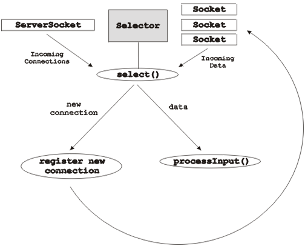
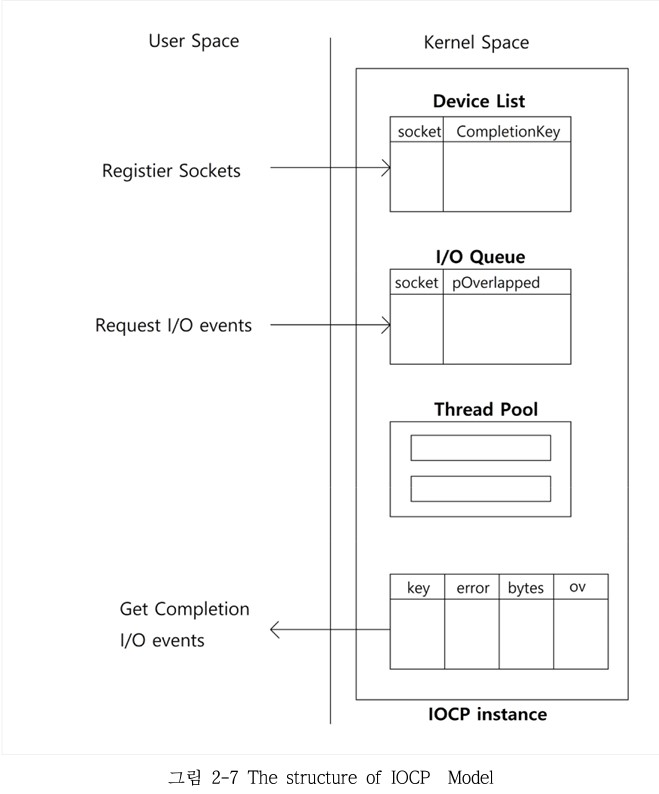
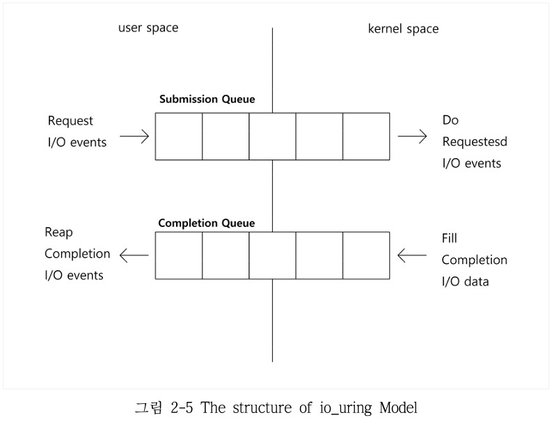

## IOCP

### I / O 모델

#### 블로킹(Blocking) I / O 모델

> - **개요**
>   - 스레드 당 하나의 I / O 요청을 처리하는 모델
>   - inputStream, outputStream을 통해 데이터 I / O를 처리
> - **작업 순서**
>   1. 스레드에서 I / O 작업을 요청
>   2. 스레드는, I / O 작업이 끝날 때 까지 다음 라인을 수행할 수 없음
>   3. I / O 작업이 끝난 이후에 다음 라인을 수행
> - **장점**
>   - 직관적이며, 이해하기 쉽다. 
> - **단점**
>   - 스레드 당 하나의 연결만 가능하다. (1 연결 / 1 스레드)
>     - 각 스레드는 스택 메모리를 사용한다. 
>     - 다수의 스레드를 생성하고, 컨텍스트 스위칭 작업을 하는 것은 오버헤드가 존재한다. 
>   - **C10K** 문제 (Connection 10K)
>     - 10K, 1만개의 연결을 처리해야하는 서버에서 발생하는 문제
> - **코드**
>   - https://github.com/arukshani/JavaIOAndNIO/blob/master/src/com/ruk/blocking/io

#### 논-블로킹(Non-Blocking) I / O 모델 (NIO)

> - **개요**
>
>   - 스레드는 동시에 다수의 I / O 요청을 처리한다. (multiple, concurrent)
>
> - **자바의 NIO 모델**
>
>   - 데이터 I / O
>     - 데이터의 조각인 Buffer를 통해 데이터 I / O를 처리
>     - ByteBuffer, CharBuffer, ...
>   - Channel 객체
>     - 클라이언트 소켓의 요청을 읽어들인다. 
>     - 클라이언트 소켓에 데이터를 응답한다. 
>   - Selector 객체
>     - 작업이 가능한 소켓 채널을 관리한다. 
>     - 소켓 채널의 키의 집합(Set 구조)을 관리한다. 
>     - Registered, Selected, Cancelled 키의 집합을 사용한다. 
>
> - **단점**
>
>   - send 버퍼의 여유 공간이 부족할 경우 문제가 발생한다. 
>
> - **코드**
>
>   - https://github.com/arukshani/JavaIOAndNIO/tree/master/src/com/ruk/nio
>
> - **이미지**
>
>   

#### 비동기(Async) I / O 모델

> - **개요**
>   - I / O 작업을 등록한 이후, I / O 작업과 상관 없는 프로세스를 계속 처리하는 모델
>   - 그렇지만, I / O 처리가 완료된 이후에 가능한 작업은 완료를 기다려야 한다. 
>     - JavaScript의 async - await과 유사한 흐름
> - **특징**
>   - 난이도가 높고, 신경써야 할 부분이 많다. 
>     - 자원 충돌, 이에 따른 예외 발생 (교착 상태, 상호 배제 실패 등)
> - **구현체**
>   - IOCP, Input / Output Completion Port
>     - 기존 Windows 최고 성능 API
>   - RIO, Registered I/O Model
>     - Windows 8.1 이상
>   - io_uring
>     - Linux 5.1 이상

---

### IOCP

- **개요**

  - 비동기 I / O 작업을 위한 API

  - 기존 Windows I / O 모델 중 최고 성능
    - 현재는 Windows의 RIO (Registered I / O)

- **작업 - 서버 기준**

  1. IOCP 객체 생성
     - Device List
     - I / O Queue
     - Thread Pool
     - Completion Queue
  2. 소켓 등록
     - CompletionKey
       - 소켓과 함께 유니크한 Key를 같이 등록한다. 
       - 완료된 I / O에서 소켓을 판별
  3. 완료된 I / O를 요청
     - 요청 시 Thread Pool에 등록
       - 완료된 I / O가 들어올 경우, Thread Pool에서 꺼내와서 처리한다. 
  4. I / O 이벤트 등록
     - 직접 I / O 이벤트를 등록하는 경우에 사용
     - 등록한 이벤트는 작업자(Worker) 스레드가 처리
     - 예) 게임 서버의 NPC

- **이미지**

  

---

### 참고

- io_uring 모델

  

---

### Reference

- [Blocking I/O and non-blocking I/O | by Rukshani Athapathu](https://medium.com/coderscorner/tale-of-client-server-and-socket-a6ef54a74763)
- [The C10K problem - Dan Kegel](http://www.kegel.com/c10k.html)
- [JavaTpoint - Java NIO Selector](https://www.javatpoint.com/java-nio-selector)
- [Asynchronous I/O - Wikipedia](https://en.wikipedia.org/wiki/Asynchronous_I/O)
- ["Ringing in a new asynchronous I/O API"](https://lwn.net/Articles/776703/)
- 성소윤. "io_uring I/O 모델을 통한 I/O 집중적인 작업의 성능 향상." 국내석사학위논문 한국산업기술대학교 일반대학원, 2021.
- [I/o 완료 포트 - Win32 apps](https://docs.microsoft.com/ko-kr/windows/win32/fileio/i-o-completion-ports)
- [Input/output completion port - Wikipedia](https://en.wikipedia.org/wiki/Input/output_completion_port)