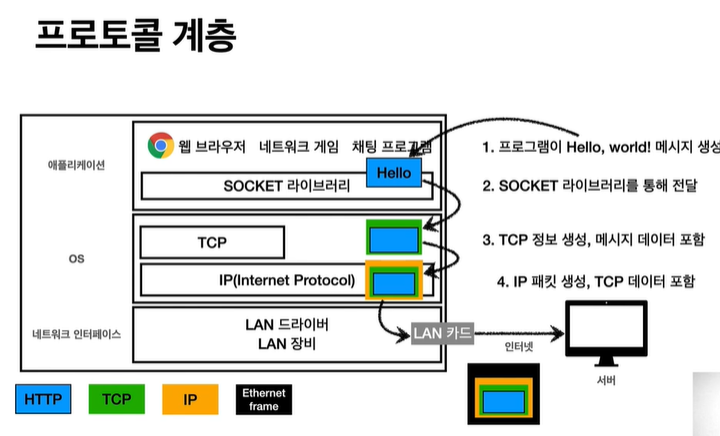
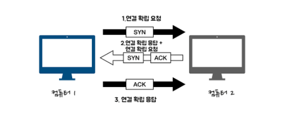
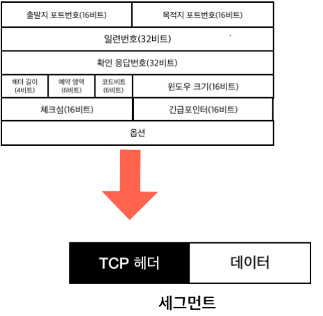
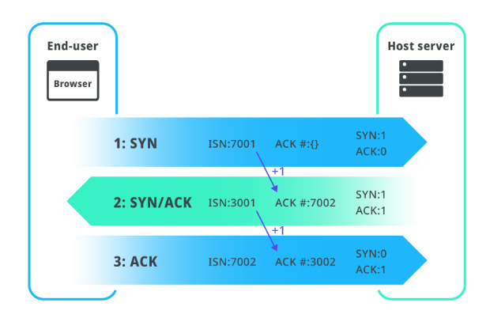
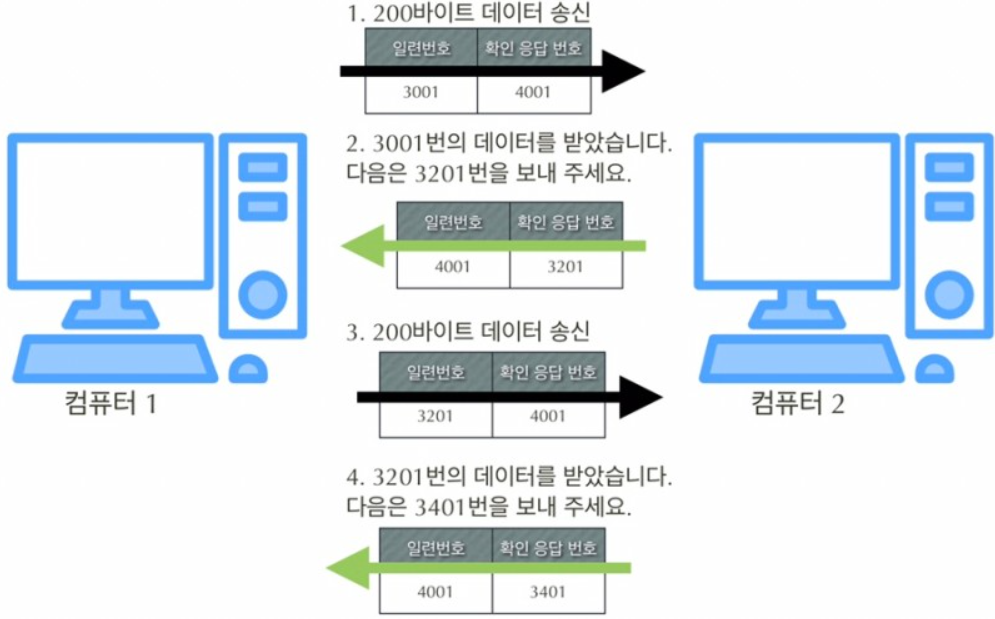
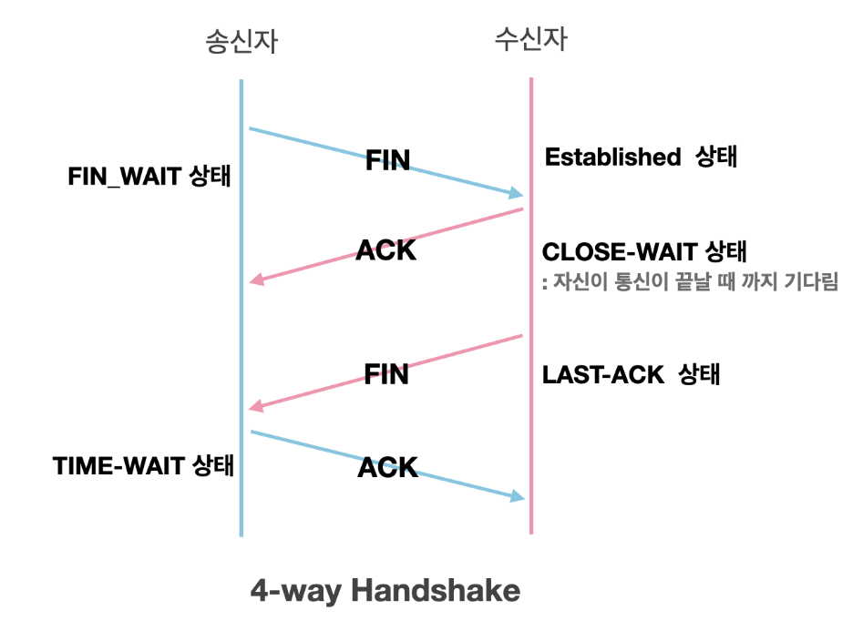
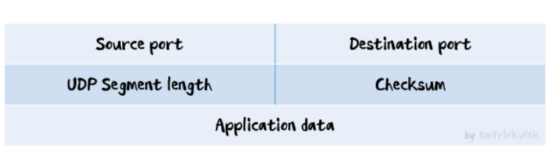

# TCP와 UDP의 차이
## TCP

 **전송계층**의 프로토콜 중 하나로, 데이터를 정확하게 전달하는 것을 목표로 하는 **연결형 통신이다.** 이와 반대로, 효율적으로 데이터를 보내는 것을 **비연결형 통신**이라 하고 **UDP**가 대표적이다. 

<aside>
👉 **연결형, 비연결형 통신**
 **전송 계층**의 통신을 **특성에 따라 두가지로 분류**한 것이다. **연결형은** 데이터를 보낼 때마다 여러 번 확인하는 절차를 통해 **신뢰성/정확성**을 우선하는 통신이고, **비연결형은** 확인 절차 없이 일방적으로 보내서 **효율성**을 지키는 통신 방식이다.

</aside>

  TCP는 통신 시 신뢰성을 높이기 위한 여러 과정이 존재하기 때문에 **높은 신뢰성을 보장하지만 속도는 느린 프로토콜**이다. 하지만 **신뢰성이라는 장점 때문에 대부분의 Web 통신에서 사용**하는 프로토콜이다. (HTTP 3은 UDP의 개량형인 QUIC 프로토콜 사용)

 TCP 세그먼트는 출발지, 목적지 PORT와 전송 제어, 순서, 검증 정보 등을 가진다.

> PORT는 하나의 IP(컴퓨터)에 다양한 애플리케이션 중 어떤 애플리케이션에 정보를 전달할 지를 구분하는 정보가 된다.
> 

### TCP 특징

- **연결지향 - 3 way handshake**
- **데이터 전달 보증**
- **순서 보장**

### 3 way handshake

1. 클라이언트가 서버로 **SYN(접속요청)** 보냄
2. 서버가 클라이언트에 **SYN + ACK(요청수락)** 보냄
3. 클라이언트가 서버의 SYN요청에 대한 **ACK**보냄
4. 실제 물리적 연결이 아닌 **논리적인 연결이 구축**되었고, 클라이언트가 서버에 **데이터를 전송**함. (최근에는 최적화로 3번 과정에서 바로 데이터도 보냄)

### 데이터 전달 보증

데이터를 전달하면 서버에서 응답을 보내준다. 클라이언트가 응답을 받지 못하면 데이터 전달에 이상이 생겼다고 인식한다.

### 순서 보장

패킷1, 2, 3순서로 전송했고, 서버가 1,3,2순서로 도착하면 서버는 클라이언트한테 2번부터 다시 보내라는 요청을 한다. (내부적으로 순서를 처리하는 로직을 구현할 수는 있지만 네트워크에서 보장하는 것이 더 좋다.)

## UDP

 기능이 거의없다. IP패킷에 PORT와 체크섬 정도만 추가된 정도이다. 따라서 애플리케이션에서 추가적인 작업이 필요하다.

 하지만 기능이 거의 없다는 것은 반대로 입맛에 맞게 확장시킬 여지가 많다는 것이 된다. 최근에는 구글에서 HTTP 3의 프로토콜로 QUIC을 사용하는데 이는 UDP프로토콜의 확장버전 같은 것이다.

## 세부설명

### TCP/IP 4계층

 OSI 7계층과 함께 네트워크 모델이지만 차이점이 있다. OSI 7계층은 장비 개발이나 통신 자체의 표준으로 사용되는 이론적인 모델이다.

TCP / IP 모델은 **실질적인 통신에 사용되는 프로토콜의 모음**으로, **클라이언트-서버 모델**이다.

 그 중 TCP는 **전송계층**에 해당하는 프로토콜이다(IP는 네트워크 계층). 전송계층은 목적지에 신뢰할 수 있는 데이터를 전달하기 위해 필요하다. 주요한 기능으로는 **오류 점검 기능**과 **목적지의 어떤 애플리케이션에 데이터 전달할 지 식별**하는 기능이 있다.

### TCP Segment

 TCP는 데이터를 받아 **청크단위로 분할**한 뒤 TCP헤더를 붙여 **TCP Segment를 생성**한다(**캡슐화**). 

> **청크 :** png, mp3 등 많은 멀티미디어 형식에서 사용되는 정보 조각
> 

> **Segment :**  OSI 7계층 중 **전송계층의 data단위** (TCP 패킷은 잘못된 표현!)
> 

 **TCP Segment는 헤더 섹션과 데이터 섹션으로 구성**된다. TCP 헤더는 **10개의 필수 필드 및 옵션 확장 필드를 포함**한다. 헤더 뒤에는 데이터 섹션이 따라온다.

다음은 TCP 헤더의 구성 정보의 일부이다.

1. **Sequence number(일련번호, 32 bits)**
    - 송신 측이 수신 측에 현재 **몇 번째 데이터를 전송**하는지 알려주는 정보. (전송하는 데이터에 일련번호 부여)
    - SYN Flag = 1인 경우(활성 상태), 일련번호는 초기 시퀀스 번호로, 다음차례에 보낼 세그먼트의 ACK number는 이 값에 +1 한 값이 됨
    - SYN Flag = 0인 경우(비활성 상태), 현재 세션의 세그먼트 데이터의 누적 시퀀스 번호이다.
2. **Acknowledgment number (확인 응답 번호, 32 bits)**
    - 수신 측이 **몇 번째 데이터를 수신했는지 송신 측에 알려주는 역할**
    - 따라서 이 번호는 **다음에 받을 데이터를 요청할때도 사용**됨.
    - ACK 플래그가 설정된 경우 이 필드의 값은 **수신자가 예상하는 다음 시퀀스 번호이다.**
3. **Data offset(헤더 길이, 4 bits) :** TCP 헤더 크기값
4. **Code Bit(6 or 9bits) :** 1 bit flag들로 구성
    - ACK
        - Acknowledgment 필드의 값이 유효함을 나타낸다.
        - SYN 패킷 이후 전송되는 모든 패킷은 이 플래그가 1로 설정되어 있어야 한다.
    - SYN
        - 동기화 시퀀스 번호, 양쪽이 보낸 최초의 패킷에만 이 플래그가 1로 설정되어 있어야 한다.
        - 다른 일부 플래그들의 의미가 이 플래그의 값에 따라 바뀐다.
    - FIN
        - 송신측에 남은 데이터가 없음을 나타낸다.
5. **Reserved (3 비트) :** 미래에 사용하기 위해 비워둔 예비 필드이다. 0으로 이뤄져 있다.
6. **Checksum** : 헤더 및 데이터의 에러 확인을 위해 사용된다.
7. **Options** : 데이터 오프셋 필드에 의해 결정된다.
8. **Padding** : TCP 헤더의 종료 지점과 데이터의 시작 지점을 32 bit 단위에 맞추기 위해 사용되며, 값은 0이다.

### 3 way handshake (연결 구축)

이 작업의 실제 수행 과정이다.

1. **SYN**
    
    Client가 Server에게 SYN 메시지를 보낸다.이 메시지에 포함된 Sequence number는 클라이언트가 임의로 설정한 값 `A`이다.
    
2. **SYN-ACK**
    
    Server가 Client에게 SYN-ACK 메시지로 응답한다.메시지에 포함된 Sequence number는 서버가 임의로 설정한 값 `B`이며, Acknowledgment number는 `A + 1` 이다.
    
3. **ACK**
    
    Client가 Server에게 ACK 메시지를 보낸다.이 메시지에 포함된 Acknowledgment number는 `B+1` 이다.
    

SYN, ACK number에 대한 요약은 다음과 같다.

`Seq(n) = Ack(n-1)` , `Ack(n) = Seq(n-1) + Segment_size`

### 데이터 전송 과정

1. 데이터 전송 전, 연결 수립단계인 3 way handshake과정에서 이번 통신 단계의 **일련번호 3001번과 확인 응답번호 4001이 결정**된다.
2. 컴퓨터 1이 200바이트의 데이터를 컴퓨터 2로 전달한다.
3. 컴퓨터 2는 200바이트 수신 후 다음에 수신하고자 하는 데이터 번호 3201번(3000 + 200 + 1)을 확인 응답 번호에 넣어서 컴퓨터 1에 응답한다. (컴퓨터 1의 확인 응답 번호는 일련번호에 저장)
4. 컴퓨터 1은 컴퓨터 2로 3201번 부터 다시 200바이트를 전송한다.
5. 2 ~ 4 과정을 반복한다.

이 과정에서 일련번호와 확인 응답 번호를 확인하며 **데이터가 손상되거나 유실된 경우**에는 데이터를 재전송한다. 이를 **재전송 제어**라고 한다. 데이터 전송 도중 오류 발생 시 일정 시간 대기 후에 재전송한다.

### 버퍼를 이용한 전송 효율 개선

위의 과정은 하나의 요청을 보내고 응답을 기다리기 때문에 효율이 낮은 방식이다. 따라서 **버퍼에 세그먼트를 연속해서 보내고 난 다음에 확인 응답을 반환 받는 방식으로 개선**을 했다.

 이 과정에서 세그먼트를 과도하게 보내서 버퍼가 넘치는 **오버플로우 현상**이 발생할 수 있다. TCP헤더의 **원도우 크기(16bit)는 바로 이 버퍼의 한계 크기값**이다. 이 윈도우 크기의 초기값은 3 way handshake를 수행할 때 판단한다.

### 포트 번호

 네트워크의 전송계층의 역할 중 하나가 **전송하는 데이터가 어떤 애플리케이션에서 사용되는지 식별**하는 것이라고 했다. 이는 **포트 번호를 통해 가능**하다. TCP 헤더에 출발지와 목적지의 포트 번호를 저장하고 있다.

 포트 번호는 0~65535번까지 있고, **0~1023번 포트는 주요 프로토콜이 사용하도록 예약**된 번호이다. 이런 포트를 **Well-known ports**라고 한다. 일반적으로 **서버 측 애플리케이션이 사용**하고 있다. 1024번은 예약은 되어있지만 사용되지 않는 번호이고, **1025번 이상은 랜덤포트**라고 부르고 **클라이언트 측의 송신 포트**로 사용한다.

> Ex) 22 - SSH, HTTP - 80, HTTPS - 443
> 

### 4 way handshake

연결 수립(3 way) → 데이터 전송 → 연결 종료의 흐름에서 **연결 종료 시 수행되는 과정**이다.

1. 클라이언트는 연결을 종료하고자 서버에 **FIN 플래그**를 보내고 **FIN_WAIT 상태**에 들어간다.
2. 서버는 클라이언트로 부터 FIN 플래그를 받은 뒤 ACK 패킷을 보낸 후 데이터를 모두 보낼 때 까지 잠시 TIME_OUT 이 된다. 이 때 서버는 ClOSE_WAIT 상태이다.
3. 서버가 연결을 종료할 준비가 되면, 연결을 해제할 준비가 되었다는 FIN 플래그를 클라이언트에 전송하고, 서버는 LAST_ACK 상태가 된다.
4. 클라이언트는 서버에 ACK를 보내 응답하고 클라이언트의 상태는 FIN_WAIT 에서 TIME-WAIT 으로 변경된다. 클라이언트의 ACK 응답을 받은 서버는 연결을 해제한다.이 때, 클라이언트는 ACK 를 보낸 이후 일정 시간동안 기다리게 되는데, 아직 서버에서 받지 못한 데이터가 연결이 해제되어 유실되는 경우를 대비해 잉여 패킷을 기다리는 TIME_WAIT 상태를 일정 시간 유지하게 된다.

### UDP Segment

UDP는 비연결형 통신이기 때문에 상대방을 확인하지 않고 연속해서 데이터를 보낸다. 따라서 같은 랜이나 네트워크 장비에 브로드캐스트 통신할 때 사용할 수 있다.