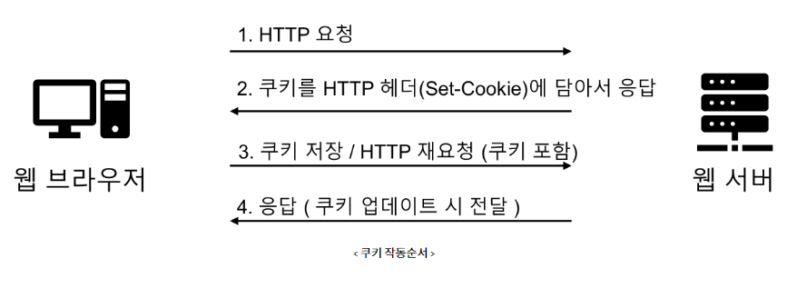
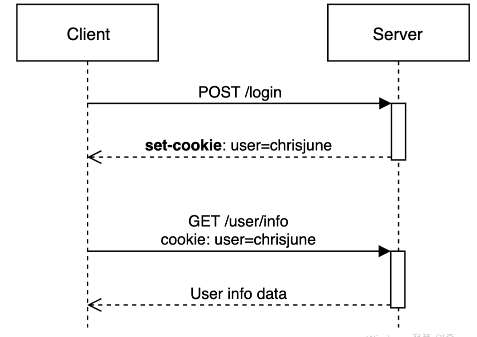

## 1. 쿠키 / 세션의 필요성

---

HTTP의 특성 중 하나인 Stateless는 이전의 요청과 현재의 요청 간의 연결고리가 없도록 하는 특성이다. 이런 구조는 중간에 요청을 받는 서버가 바뀌어도 이전의 요청에 대해서 고려할 필요가 없기 때문에 서버 디자인이 간결해지고, 무한한 서버 증설이 가능하다는 장점이 있다.

하지만, 실제 웹 어플리케이션에서는 사용자의 회원 정보나 장바구니의 상품 목록 등과 같이 **이전의 상태정보를 유지해야 하는 경우**도 있다. 이런 경우를 보완하기 위해 쿠기와 세션을 사용한다.

## 쿠키(Cookie)

---

- **클라이언트 로컬**에 저장되는 **키와 값**이 들어있는 파일이다.
- 이름, 값, 유효 시간, 경로 등을 포함하고 있다.
- 클라이언트의 상태 정보를 브라우저에 저장하여 참조한다.
- 클라이언트에 **최대 300개**까지 쿠키 저장 가능하다.
  - 하나의 **도메인당 20개**의 값만 가질 수 있다.
  - 하나의 **최대 쿠키 크기는 4KB**

### 구성 요소

- 이름 : 각각의 쿠키를 구별하는 데 사용되는 이름
- 값 : 쿠키의 이름과 관련된 값
- 유효시간 : 쿠키의 유지시간
- 도메인 : 쿠키를 전송할 도메인
- 경로 : 쿠키를 전송할 요청 경로

### 동작 방식

1. 클라이언트가 페이지를 요청(사용자가 웹사이트 접근)
2. 서버에서 쿠키를 생성
3. HTTP 헤더에 쿠키를 포함 시켜 응답
4. 브라우저가 종료되어도 쿠키 만료 기간이 있다면 클라이언트에서 보관하고 있음
5. 서버에 재요청 시 HTTP 헤더에 쿠키를 함께 보냄
6. 서버에서 쿠키를 읽는다. 이전 상태 정보를 변경 할 필요가 있으면 쿠키 업데이트 후 변경된 쿠키를 HTTP 헤더에 포함시켜 응답

### 사용 목적

- **세션 관리** : 서버에 저장해야할 로그인, 장바구니 등 정보 관리
- **개인화** : 사용자 선호, 테마, 추천 등
- **트래킹** : 사용자 행동 기록 및 분석

### 예시

- 방문했던 사이트에 다시 방문 하였을 때 아이디와 비밀번호 자동 입력
- 팝업창을 통해 "오늘 이 창을 다시 보지 않기" 체크

## 세션

---

어떤 클라이언트의 요청인지 서버가 식별하게 해주는 정보이다. 정확히는 서버에 정보를 저장하고 세션 쿠키를 통해 클라이언트를 식별하는 방식이다.

### 동작순서

- 클라이언트가 서버로 요청(HTTP)을 보낸다.
- 서버는 HTTP **요청 헤더의 cookie 필드**에 **session-id가 있는지 확인**한다.
- 만약 없다면, 서버는 클라이언트 식별자인 **session-id(임의의 문자열)을 발행하고 HTTP 응답 헤더의 set-cookie 필드값**으로 넣어준다.
- 이 session-id는 클라이언트 **로컬에 쿠키로 저장**된다.
- 이후 해당 클라이언트는 요청 시 해당 쿠키를 헤더에 담아서 요청하기 때문에 서버는 이 **쿠키값으로 사용자를 식별**한다.

### **세션 특징**

- 서버의 메모리(정확히는 WAS의 세션 저장소)에 저장된다.
- 서버에 데이터가 저장되기 때문에 조금 더 안전하다.
- 저장 데이터에 제한이 없다.(서버 용량이 허용하는 한..)

# **쿠키와 세션의 차이점**

쿠키와 세션의 차이점은 총 3**가지**이다.

1. **저장위치 :** 쿠키는 로컬에, 세션은 로컬과 서버에 저장된다.
2. **보안 :** 쿠키는 탈취와 변조가 가능하지만, 세션은 ID값만 가지고 있고 서버에도 저장이 되어있기 때문에 상대적으로 안전하다.
3. **Lifecycle :** 쿠키는 브라우저를 종료해도 파일로 남아있지만, 세션은 브라우저 **종료 시 세션을 삭제**한다.
