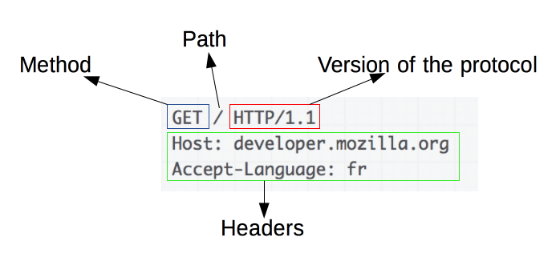

# HTTP와 HTTPS의 차이는?

### HTTP : Hyper Text Transfer Protocol

- **서버/클라이언트 모델을 따라 데이터를 주고 받기 위한 프로토콜**
- 1989년 팀 버너스 리(Tim Berners Lee)에 의해 처음 설계
- WWW(World-Wide-Web) 기반에서 세계적인 정보를 공유하는데 큰 역할
- 애플리케이션 레벨의 프로토콜로 TCP/IP 위에서 작동
- **암호화가 되지 않은 평문 데이터를 전송하는 프로토콜**
- 누군가 **네트워크 신호를 가로챈다면 HTTP의 내용은 그대로 외부에 노출**
  ⇒ 이 문제를 해결하기 위해 HTTPS가 등장

### HTTPS : Hyper Text Transfer Protocol Secure

- HTTP에 **데이터 암호화가 추가된 프로토콜**
- 브라우저는 HTTPS의 적용을 자물쇠로 알려줌
- HTTPS는 **SSL(Secure Sockets Layer)**이라는 **보안 계층** 위에 HTTP를 얹어서 **보안이 보장된 통신을 하는 프로토콜**
  →**SSL 암호화 통신**
  SSL 암호화 통신은 **공개키 암호화 방식**이라는 알고리즘을 통해 구현

### 대칭키 암호화와 비대칭키 암호화

**대칭키 암호화**

- 클라이언트와 서버가 **동일한 키**를 사용해 암호화/복호화를 진행함
- 키가 노출되면 매우 **위험**하지만 **연산 속도가 빠름**
  

**비대칭키 암호화**

- 1개의 쌍으로 구성된 **공개키**(모두에게 공개 가능한 키)와 **개인키**(나만 가지고 알고 있어야 하는 키)를 암호화/복호화 하는데 사용함
- 키가 노출되어도 비교적 **안전**하지만 **연산 속도가 느림**

### HTTPS의 동작 과정

- **대칭키 암호화와 비대칭키 암호화를 모두 사용**
  → 빠른 연산 속도와 안정성
- HTTPS 연결 과정(Hand-Shaking)

1. 서버와 클라이언트 간에 세션키(주고 받는 데이터를 암호화하기 위해 사용되는 대칭키) 교환
   → 데이터 간의 교환에는 빠른 연산 속도가 필요하므로 세션키는 대칭키
2. 클라이언트와 서버가 세션키를 교환하는 과정에서 비대칭 키 사용

**[실제 HTTPS 연결 과정이 성립되는 흐름]**

1. 클라이언트(브라우저)가 서버로 최초 연결 시도를 함
2. 서버는 공개키(엄밀히는 인증서)를 브라우저에게 넘겨줌
3. 브라우저는 인증서의 유효성을 검사하고 세션키를 발급함
4. 브라우저는 세션키를 보관하며 추가로 서버의 공개키로 세션키를 암호화하여 서버로 전송함
5. 서버는 개인키로 암호화된 세션키를 복호화하여 세션키를 얻음
6. 클라이언트와 서버는 동일한 세션키를 공유하므로 데이터를 전달할 때 세션키로 암호화/복호화를 진행함

### HTTPS의 인증서 발급 과정

- CA(Certificate Authority)라는 인증된 기관에 공개키를 전송하여 인증서를 발급
- 브라우저에는 인증된 CA 기관의 정보들이 사전에 등록되어 있어 인증된 CA 기관의 인증서가 아닐 경우에는 다음과 같은 형태로 브라우저에 출력됨

**[서버가 비대칭키를 발급받는 과정]**

1. A기업은 HTTP 기반의 애플리케이션에 HTTPS를 적용하기 위해 공개키/개인키를 발급함
2. CA 기업에게 돈을 지불하고, 공개키를 저장하는 인증서의 발급을 요청함
3. CA 기업은 CA기업의 이름, 서버의 공개키, 서버의 정보 등을 기반으로 **SSL 인증서**를 생성하고, CA 기업의 개인키로 암호화하여 A기업에게 이를 제공함
4. A기업은 클라이언트에게 암호화된 인증서를 제공함
5. 브라우저는 CA기업의 공개키를 미리 다운받아 갖고 있어, 암호화된 인증서를 복호화함
6. 암호화된 인증서를 복호화하여 얻은 A기업의 공개키로 세션키를 공유함
