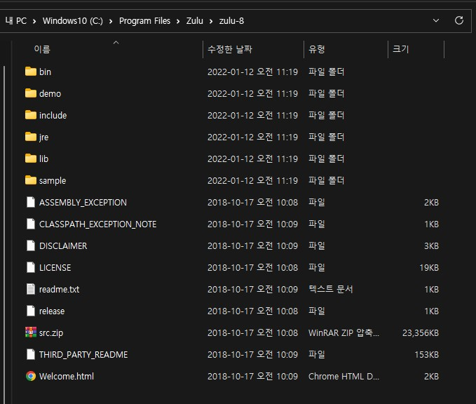
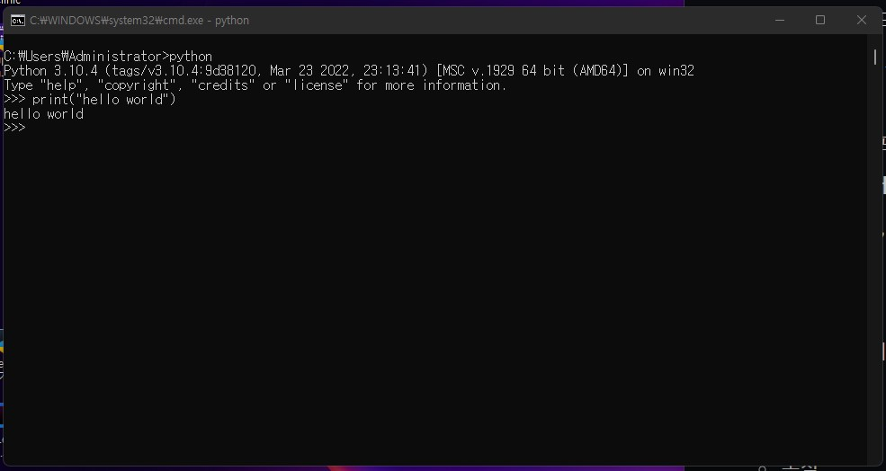

##Java 컴파일 과정

### 개요

> - **JDK**; Java Development Kit
>   - 정의 / 구성 요소
>     - java, javac, javadoc
>     - **JRE**; Java Runtime Environment
> - **컴파일러**
>   - 컴파일러란?
>   - 자바의 컴파일러, 바이트 코드, 실행 방식
> - **JVM 동작 방식**
>   - 클래스 로더
>   - 메모리
>   - 실행 엔진
>   - JNI (Java Native Interface)

---

### JDK

> - 정의
>
>   - 자바 어플리케이션 및 애플릿 개발에 사용되는 소프트웨어 개발 환경
>
> - 구성 요소
>
>   - **JRE** - 자바 런타임 환경
>   - **java** - 인터프리터 / 로더
>   - **javac** - 컴파일러
>   - **jar** - 아카이버 (Archiver)
>   - **javadoc** - 문서 생성기
>   - ...
>
> - 이미지
>
>   
>
>   - **bin** - 실행 가능한(.exe) 파일
>   - **demo / sample** - 데모 / 샘플 코드
>   - **include** - .h (헤더 파일)
>   - **lib** - 라이브러리
>     - 네이티브 메서드에 대한 라이브러리
>   - **jre** - 자바 런타임 환경

---

### 컴파일러

> - **정의**
>
>   - 특정 프로그래밍 언어로 쓰인 문서를, 다른 프로그래밍 언어로 옮기는 언어 번역 프로그램
>     - 소스 코드에서 목적 코드로 옮긴다. 
>
> - **이유**
>
>   - 주로, 고급 프로그래밍 언어에서부터 / 실행 가능한 기계어 프로그램을 만드는 것
>
> - **자바의 컴파일러**
>
>   - 자바 언어를, 가상 머신(JVM)에서 동작하는 바이트 코드로 옮기는 컴파일러
>
> - **바이트 코드**
>
>   - 역사
>     - 대부분의 명령 집합이 1 바이트 크기의 명령 코드(opcode)를 가져서 바이트 코드로 불리게 되었다. 
>       - 명령 집합 = instruction sets
>   - 목적
>     - 하드웨어에 대한 의존성을 줄이며, 인터프리팅을 쉽게 한다. 
>   - 실행 방식
>     - *인터프리터*
>       - 하나의 명령을 읽은 후 실행한다. 
>     - *JIT 컴파일러 (Just In Time)*
>       - 바이트 코드 실행 전에, JIT 컴파일러에 의해 기계어로 번역된다. 
>       - 프로그램 실행 초반에, 기계어 번역에 시간이 소모된다. 
>
> - **인터프리터**
>
>   - 소스 프로그램을 읽은 즉시 결과를 출력한다. 
>
>     
>
>     - 파이썬도 JIT 컴파일러가 있다. (pypy)

---

### 자바 가상 머신(JVM)

> - **정의**
>
>   - 자바 어플리케이션의 런타임 엔진
>   - 자바 바이트코드를 실행할 수 있는 주체
>
> - **특징**
>
>   - 플랫폼에 독립적이지 않다. 
>
> - **클래스 로더**
>
>   - 과정
>     - 로딩(Loading)
>       - .class 파일을 읽어서, 클래스의 정보를 메서드 영역에 저장한다. 
>         - java.lang.Class의 인스턴스이다. 
>         - 클래스명, 변수명, 메서드명, 등을 저장한다. 
>         - 싱글톤 패턴
>     - 링킹(Linking)
>       - 검증(Verification)
>         - 바이트 코드의 형식과, 올바른 컴파일러로 구현되었는지 검증한다. 
>       - 준비(Preparation)
>         - 클래스의 멤버 변수를 위한 메모리를 할당하고, 이를 디폴트 값으로 초기화한다. 
>       - 해결(Resolution)
>         - Symbolic 참조를 direct 참조로 변환한다. 
>     - 초기화(Initialization)
>       - static 변수는 코드에 정의된 값을 갖는다. 
>       - static 블럭은 실행된다. 
>   - 종류
>     - Bootstrap class loader
>       - 네이티브 언어로 구현되어 있다. 
>       - /jre/lib
>     - Extension class loader
>       - 추가적인 라이브러리를 로딩한다. 
>       - /jre/lib/ext
>     - System/Application class loader
>       - 어플리케이션의 classpath에서 로딩한다. 
>
> - **메모리**
>
>   - 메서드 영역(Method Area)
>     - static한 변수 / 블럭 / 참조 값을 저장
>   - 힙 영역(Heap Area)
>     - 객체
>   - 스택 메모리(Stack Memory)
>     - 지역 변수
>   - PC 레지스터
>   - 네이티브 메서드 스택
>
> - **실행 엔진**
>
>   - 인터프리터
>     - 바이트 코드의 명령을 하나씩 읽어서 실행한다. 
>   - JIT 컴파일러
>     - 메서드가 반복적으로 호출될 경우, JIT 컴파일러는 이에 대한 네이티브 코드를 제공한다. 
>   - GC
>     - 참조되지 않는 객체를 파괴한다. 
>     - Daemon Thread - 우선 순위가 낮은 스레드 (서포터)
>   - JNI; Java Native Interface
>     - JVM과 C / C++로 작성된 라이브러리 간의 인터페이스
>
> - **이미지**
>
>   

---

### Reference

- [자바 (프로그래밍 언어) - 위키백과, 우리 모두의 백과사전](https://ko.wikipedia.org/wiki/자바_(프로그래밍_언어))
- [컴파일러 - 위키백과, 우리 모두의 백과사전](https://ko.wikipedia.org/wiki/컴파일러)
- [JIT 컴파일 - 위키백과, 우리 모두의 백과사전](https://ko.wikipedia.org/wiki/JIT_컴파일)
- [바이트코드 - 위키백과, 우리 모두의 백과사전](https://ko.wikipedia.org/wiki/바이트코드)
- [자바 가상 머신 - 위키백과, 우리 모두의 백과사전](https://ko.wikipedia.org/wiki/자바_가상_머신)
- [Differences between JDK, JRE and JVM - GeeksforGeeks](https://www.geeksforgeeks.org/differences-jdk-jre-jvm/)
