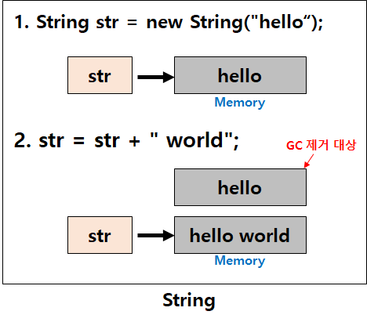

# String, StringBuffer, StringBuilder의 차이점

### String

- **불변성(immutable)**

```java
String str = "hello";   // String str = new String("hello");
str = str + " world";  // [ hello world ]
```



- str이 가리키는 곳에 저장된 "hello"에 "world" 문자열을 더해 "hello world"로 값 변경 **(X)**
- str이 "hello world"라는 값을 가지고 있는 **새로운 메모리 영역을 가리키도록 변경 (O)**

→ 처음 선언했던 "hello"로 값이 할당되어 있던 메모리 영역은 **Garbage로 남아있다가 GC(garbage collection)에 의해 사라짐**

⇒ **String 클래스는 불변**하기 때문에 **문자열을 수정하는 시점에 새로운 String 인스턴스가 생성된 것**

- 따라서 **변하지 않는 문자열을 자주 읽어들이는 경우 String을 사용**
- 반대로 문자열의 **연산이 빈번하게 발생**하는 경우에 String 클래스를 사용하면 **힙 메모리(Heap)에 많은 임시 가비지(Garbage)가 생성**되어 **힙메모리가 부족해짐**

### **StringBuffer** / **StringBuilder**

- **가변(mutable)성**

```java
StringBuffer sb = new StringBuffer("hello");
sb.append(" world");
```


- .append() .delete() 등의 API를 이용하여 **동일 객체내에서 문자열을 변경하는 것이 가능**
  → 기존 객체의 공간이 부족하게 되는 경우 **기존의 버퍼 크기를 늘리며** 유연하게 동작
- 따라서 **문자열의 연산이 빈번**하게 발생할 경우라면 String 클래스가 아닌 **StringBuffer / StringBuilder를 사용**

### **StringBuffer  vs  StringBuilder**


- StringBuffer와 StringBuilder 클래스가 제공하는 **메서드는 서로 동일**
- 가장 큰 차이점 : **동기화의 유무**
- **StringBuffer**는 **동기화 키워드를 지원**하여 **멀티쓰레드 환경에서 안전(thread-safe)**
  (참고로 **String**도 **불변성**을 가지기때문에 **멀티쓰레드 환경에서의 안정(thread-safe))**
- **StringBuilder**는 **동기화를 지원하지 않기**때문에 **멀티쓰레드 환경에서 부적합**
- 다만 **단일쓰레드에서의 성능**은 StringBuffer 보다 **뛰어남**

### 참고 : **자바 synchronized 키워드**

자바 코드에서 동기화 영역은 synchronizred 키워드로 표시된다. 동기화는 객체에 대한 동기화로 이루어지는데(synchronized on some object), 같은 객체에 대한 모든 동기화 블록은 한 시점에 오직 한 쓰레드만이 블록 안으로 접근하도록 - 실행하도록 - 한다. 블록에 접근을 시도하는 다른 쓰레드들은 블록 안의 쓰레드가 실행을 마치고 블록을 벗어날 때까지 블록(blocked) 상태가 된다.
