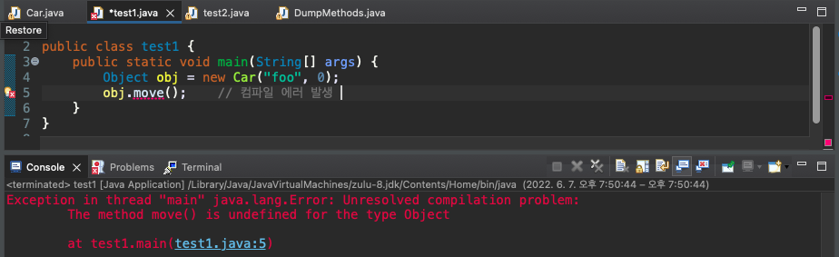
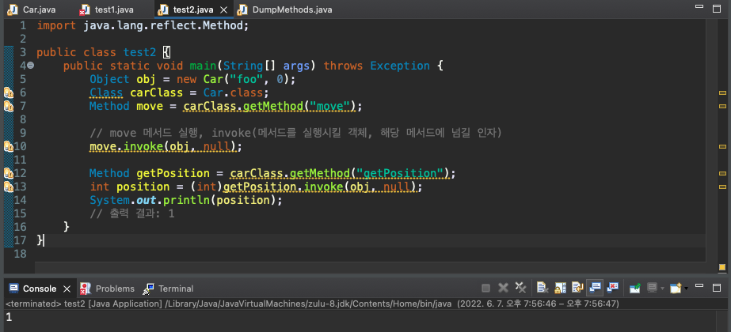
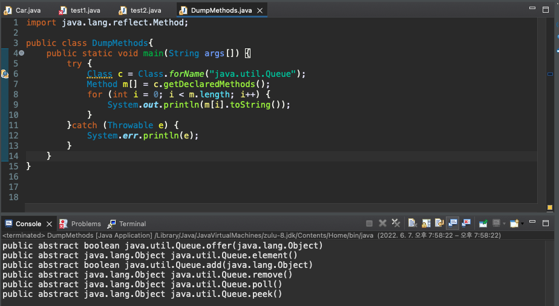

# JAVA Reflection


JAVA Reflection에 대하여 간단히 알아보자

## Reflection의 

1. 사전적 의미 : 투영, 반사 -> 어딘가를 통해 비춰진다.

2. 프로그래밍적 의미 : 객체를 통해 클래스의 정보를 분석해 내는 프로그램 기법

   > Q. 무엇이 어딘가에 비춰졌는가?
   >
   > A. 무엇(대상) = JVM의 클래스 로더에 의해 읽혀지고  메모리에 로드된 클래스 또는 클래스 구현체 정보
   >
   > ​	어딘가(거울) = 메모리
   >
   > 즉, **메모리에 비춰진 클래스 정보**(<u>구체적인 클래스 타입은 모르는 상황</u>, 메모리만 알고 있음)를 **Reflection을 <u>통해</u>** **클래스의 정보**(생성자, 메서드, 타입, 필드 등에 관한 정보)를 읽을 수 있다.
   >
   > 이 Reflection 기법을 사용하기 위해 Java에서는 [Reflection API](https://www.oracle.com/technical-resources/articles/java/javareflection.html)를 제공하고 있다.

------

예시를 통해 Reflection이 무엇인지 알아보자

다음과 같은 Car 클래스가 존재한다.

```java
public class Car {
    private final String name;
    private int position;

    public Car(String name, int position) {
        this.name = name;
        this.position = position;
    }

    public void move() {
        this.position++;
    }

    public int getPosition() {
        return position;
    }
}
```

다형성에 의해 다음과 같이 객체 생성이 가능하다.

```java
public class test1 {
	public static void main(String[] args) {
	    Object obj = new Car("foo", 0);
	}
}

```

여기서 obj 이름으로 Car클래스의 move 메소드를 사용하면



다음과 같이 에러가 발생한다. 

**자바는 컴파일러를 사용**한다.  때문에 **컴파일 타임에 <u>타입이 결정</u>**된다. 컴파일 타임에 Object로 타입이 결정됐기에 Object 클래스의 인스턴스 변수와 메서드만 사용이 가능하다.

생성된 **obj 객체는** Object 클래스 라는 타입만 알 뿐 , **Car 클래스라는 구체적인 타입을 모른다**. 이를 통해 컴파일러가 있는 **자바는 <u>구체적인 클래스를 모르면</u> 해당 클래스의 정보에 접근할 수 없다는 것을 알 수 있다**.

------

이번에는 같은 상황에서 Reflection API를 사용해 Car 클래스의 move 메서드를 호출해 보자.



move 메서드가 실행되고 0으로 초기화했던 Car 클래스 인스턴스 변수 position이 1로 마법같이 출력이 되었다. **Reflection API로 구체적인 클래스** Car **타입을 알지 못해도** move **메서드에 접근**하였다.

------

다음으로 클래스 이름으로 클래스의 메서드 정보를 가져와 보자.



클래스 이름으로 java.util.Queue를 줬고 해당 인터페이스에 선언된 메서드 정보들을 출력해 보았다.

------

어떻게 이런 것들이 가능할까?

자바에서는 JVM이 실행되면 사용자가 작성한 자바 코드가 컴파일러를 거쳐 바이트 코드로 변환되어 **<u>static 영역에 저장</u>된다**.

**Reflection API는 <u>이 정보</u>를 활용**한다. 그래서 **클래스 이름만 알고 있다면 언제든 static 영역을 뒤져서 정보를 가져올 수 있다.**

------

어디에 활용할 수 있을까?

위에서 살펴봤던 예제 코드를 보면 멀쩡한 Car 객체를 Object 타입으로 생성하고 있다. 실제로 우리가 코드를 작성할 때는 예제와 같이 작성하지 않는다. 그러므로 **우리가 코드를 작성하면서 Reflection을 활용할 일은 거의 없다**. **<u>구체적인 클래스를 모를 일이 거의 없기 때문이다.</u>**

게다가 Reflection은 마법 같은 힘을 가지고 있는 만큼 **치명적인 단점**들을 가지고 있다. 당연히 사용하지 않을 수 있다면 대부분의 경우 **사용하지 않는 게 좋다**.

치명적인 단점 중 대표적으로 **성능 오버헤드**가 있다. 컴파일 타임이 아닌 **런타임에 동적으로 타입을 분석하고 정보를 가져오므로 JVM을 최적화할 수 없기 때문**이다. 뿐만 아니라 **직접 접근할 수 없는 private 인스턴스 변수, 메서드에 접근**하기 때문에 **내부를 노출하면서 추상화가 깨진다**. 이로 인해 예기치 못한 부작용이 발생할 수 있다.

결론적으로 Reflection은 애플리케이션 개발보다는 **프레임워크나 라이브러리에서 많이 사용**된다. 프레임워크나 라이브러리는 사용자가 어떤 클래스를 만들지 예측할 수 없기 때문에 동적으로 해결해주기 위해 Reflection을 사용한다.

실제로 **intellij의 자동완성**, **jackson 라이브러리**, **Hibernate** 등등 많은 프레임워크나 라이브러리에서 Reflection을 사용하고 있다.

**Spring Framework**에서도 Reflection API를 사용하는데 대표적으로 **Spring Container의 BeanFactory**가 있다. **Bean은 애플리케이션이 실행한 후 <u>[런타임에 객체가 호출될 때 동적으로 객체의 인스턴스를 생성](https://velog.io/@woo00oo/%EC%9E%90%EB%B0%94-%EC%BB%B4%ED%8C%8C%EC%9D%BC-%EA%B3%BC%EC%A0%95)</u>**하는데 이때 Spring Container의 BeanFactory에서 리플렉션을 사용한다.

**Spring Data JPA** 에서 **Entity에 기본 생성자가 필요한 이유**도 **동적으로 객체 생성 시 Reflection API를 활용하기 때문**이다. Reflection API로 **가져올 수 없는 정보 중 하나가 <u>생성자의 인자 정보</u>**이다. 그래서 기본 생성자가 반드시 있어야 객체를 생성할 수 있는 것이다. 기본 생성자로 객체를 생성만 하면 필드 값 등은 Reflection API로 넣어줄 수 있다.


------

#### Reference

1. [Reflection API 간단히 알아보자.](https://tecoble.techcourse.co.kr/post/2020-07-16-reflection-api/)
2. [Java Reflection 정의](https://gyrfalcon.tistory.com/entry/Java-Reflection)
3. [자바 컴파일 과정](https://velog.io/@woo00oo/%EC%9E%90%EB%B0%94-%EC%BB%B4%ED%8C%8C%EC%9D%BC-%EA%B3%BC%EC%A0%95)
4. [JVM 메모리 구조 및 아키텍쳐(클래스 로더, 실행엔진 등)](https://sas-study.tistory.com/262)
5. [Java Reflection API](https://www.oracle.com/technical-resources/articles/java/javareflection.html)