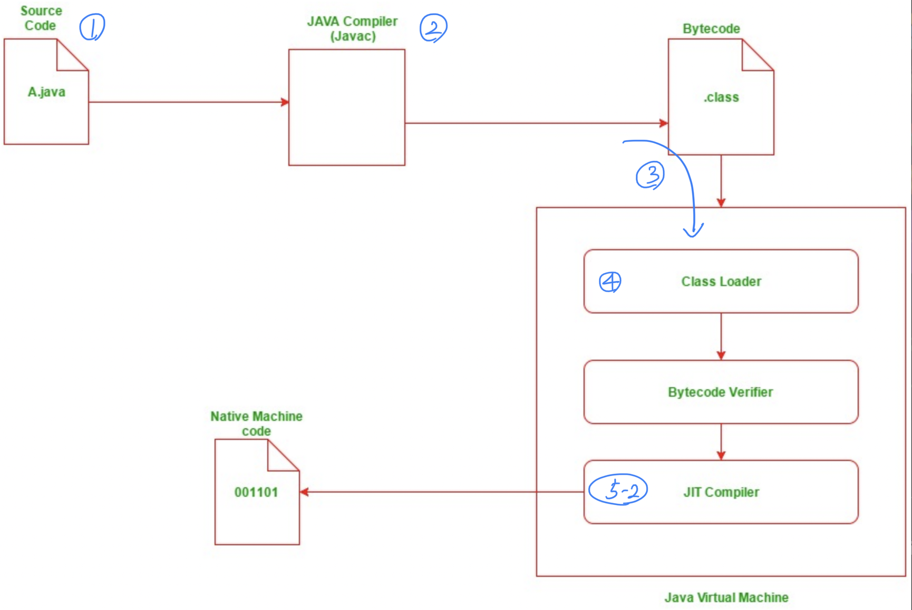
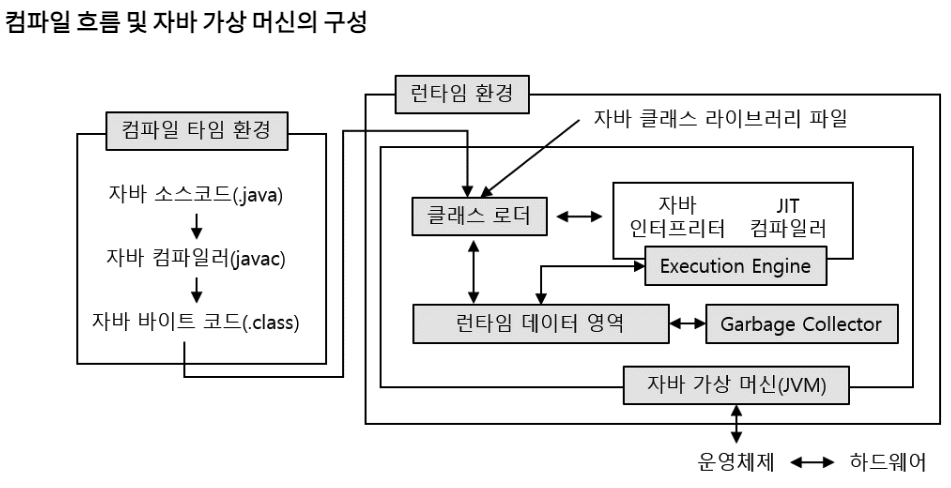
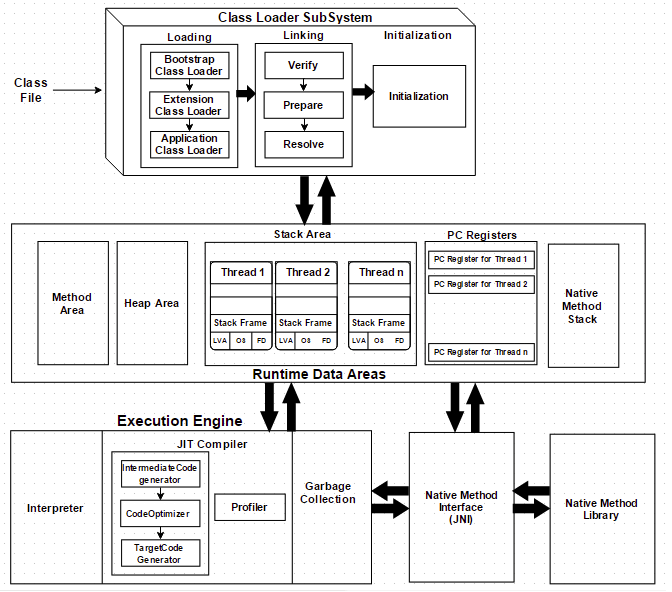

# JVM (Java Virtual Machine)과 Java Complie

우리는 자바를 흔히 플랫폼(ex. OS)에 독립적인 프로그래밍 언어라고 알고 있다. 

자바는 WORA(Write Once Run Anywhere, 한번 쓰고 언제어디서나 실행 가능) 컨셉으로 개발된 언어이다.

이를 가능하게 해준 것이 JVM이다. JVM의 어떠한 기능 때문에 플랫폼에 독립적으로 실행할 수 있는지 자바 컴파일 과정을 통해 간략히 알아보자

자바 컴파일 순서 (크게 2단계)

### 컴파일

1. 개발자가 자바 소스코드(.java)를 작성한다.

2. <u>**자바 컴파일러(Java Compiler)가 자바 소스파일을 컴파일한다.**</u>
   이때 나오는 파일은 자바 바이트 코드(.class)파일로 아직 컴퓨터가 읽을 수 없는 자바 가상 머신이 이해할 수 있는 코드이다. 바이트 코드의 각 명령어는 1바이트 크기의 Opcode와 추가 피연산자로 이루어져 있다.

   좀 더 세부적인 컴파일 단계는 7단계로 이루어져 있다.[(링크)](https://www.geeksforgeeks.org/compilation-execution-java-program/)

3. <u>**컴파일된 바이트 코드를 JVM의 클래스로더(Class Loader)에게 전달**</u>.

------

### 실행

4. 클래스 로더는 <u>**동적로딩(Dynamic Loading)을 통해 필요한 클래스들을 로딩 및 링크하여 런타임 데이터 영역(Runtime Data area), 즉 JVM의 메모리에 올린다.**</u>

- 클래스 로더 세부 동작
  a. 로드 : 클래스 파일을 가져와서 JVM의 메모리에 로드한다.
  b. <u>검증</u> : 자바 언어 명세(Java Language Specification) 및 JVM 명세에 명시된 대로 구성되어 있는지 검사한다.
  c. 준비 : 클래스가 필요로 하는 메모리를 할당(필드, 메서드, 인터페이스 등등)
  d. 분석 : 클래스의 상수 풀 내 모든 심볼릭 레퍼런스를 다이렉트 레퍼런스로 변경한다.
  e. 초기화 : 클래스 변수들은 적절한 값으로 초기화한다.(static 필드)

​	<u>4-b.</u> 바이트 코드 검증기는 클래스의 바이트 코드가 클래스 로더에 의해 JVM의 메모리에 로드되면 바이트 코드를 검증하는 역할을 하며 타입-수준의 자료흐름 분석을 통해 검증한다. 검증 항목은 다음과 같다.

1. 변수가 사용되기 전에 초기화 되었는가?
2. 메소드 호출이 개체 참조 유형과 일치하는가?
3. private data와 method를 접근하려 하는가?
4. 지역 변수를 런타임 스택 내에 접근하는가?
5. 런타임 스택이 오버플로우 되는가?

위 검사 중 하나라고 실패하는 경우 검증기는 클래스가 로드되는 것을 허용하지 않는다. <u>검증 단계에서 실패하게 되면 run-time exception 이 발생하며 발생한 예외는 [java.lang.VerifyError](https://docs.oracle.com/javase/8/docs/api/java/lang/VerifyError.html)이다.</u>

5. 실행엔진(Execution Engine)은 **JVM 메모리에 올라온 바이트 코드들을 명령어 단위로 하나씩 가져와서 실행. 이때, 실행 엔진은 두가지 방식**으로 변경한다.
   1. 인터프리터: 바이트 코드 명령어를 하나씩 읽어서 해석하고 실행한다. 하나하나의 실행은 빠르나, 전체적인 실행 속도가 느리다는 단점을 가짐.
   2. JIT 컴파일러(Just-In-Time Compiler) : 인터프리터의 단점을 보완하기 위해 도입된 방식으로 바이트 코드 전체를 컴파일하여 바이너리 코드로 변경하고 이후에는 해당 메서드를 더 이상 인터프리팅 하지 않고, 바이너리 코드로 직접 실행하는 방식이다. 하나씩 인터프리팅하여 실행하는 것이 아니라 바이트 코드 전체가 컴파일된 바이너리 코드를 실행하는 것이기 때문에 전체적인 실행속도는 인터프리팅 방식보다 빠름.

### 중간 정리 : 위에서 설명한 2단계 실행 프로세스로 인해 자바 프로그램은 플랫폼(ex. 대상 운영체제)에 독립적이다. 그러나 같은 이유로 플랫폼에 종속되어 있는 컴파일 과정을 거치는 유사한 프로그램보다는 실행 시간이 훨씬 길다.

다음시간

