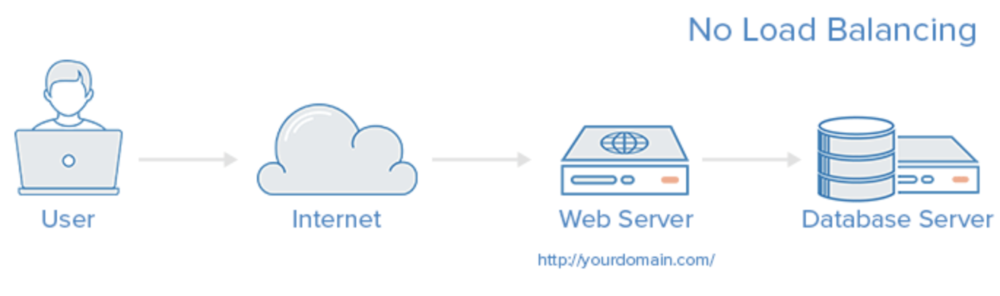

# 로드 밸런싱

### 로드 밸런싱이 필요한 이유

**[클라이언트가 1, 2명인 경우]**

**[클라이언트가 수천만명인 경우]**

→ 몰리는 트래픽을 1개의 서버로는 감당하기 어려움

**해결 방법**

1. **Scale-up** : Server가 더 빠르게 동작하기 위해 **하드웨어 성능을 올리는 방법**
2. **Scale-out** : 하나의 Server보다는 **여러 대의 Server**가 나눠서 일을 하는 방법

**Scale-out의 장점**

- 하드웨어의 성능을 올리는 비용보다 **서버를 추가하는 비용이 더 경제적**
- 여러 대의 Server로 **무중단 서비스**를 제공 가능

### 로드 밸런싱

**로드 밸런싱** : 하나의 인터넷 서비스가 발생하는 **트래픽이 많을 때 쏟아지는 트래픽을 여러 대의 서버로 분산시켜주는 기술. 서버의 로드율 증가, 부하량, 속도저하 등을 고려하여 적절히 분산처리.**

- **Load Balancer**를 클라이언트와 서버 사이에 두고, 부하가 일어나지 않도록 여러 서버에 분산시켜주는 방식
  

**목적** : 한 대의 서버로 부하가 집중되지 않도록 트래픽을 관리해 **각각의 서버가 최적의 퍼포먼스를 보일 수 있도록 하는 것**

### 로드 밸런싱 기법

**라운드 로빈(Round Robin)**

- 서버에 들어온 요청을 **순서대로 돌아가며 배정**하는 방식
- **여러 대의 서버가 동일한 스펙**을 갖고 있고, 서버와의 **연결(세션)이 오래 지속되지 않는** **경우**에 활용하기 적합

**가중 라운드로빈 방식(Weighted Round Robin)**

- 각각의 서버마다 가중치를 매기고 **가중치가 높은 서버에 클라이언트 요청을 우선적**으로 배분
- **서버의 트래픽 처리 능력이 상이한 경우** 사용되는 부하 분산 방식
- EX) A라는 서버가 5라는 가중치를 갖고 B라는 서버가 2라는 가중치를 갖는다면, 로드 밸런서는 라운드로빈 방식으로 A 서버에 5개 B 서버에 2개의 요청을 전달

**IP 해시 방식(IP Hash)**

- **클라이언트의 IP 주소를 특정 서버로 매핑**하여 요청을 처리하는 방식
- 사용자의 IP를 해싱해 로드를 분배하기 때문에 **사용자가 항상 동일한 서버로 연결**되는 것을 보장

**최소 연결 방식(Least Connection)**

- 요청이 들어온 시점에 **가장 적은 연결상태를 보이는 서버에 우선적**으로 트래픽을 배분
- **세션이 길어지거나, 서버에 분배된 트래픽들이 일정하지 않은 경우**에 적합

**최소 응답 시간 방식(Least Response)**

- 서버의 현재 연결 상태와 응답 시간(Response Time, 서버에 요청을 보내고 최초 응답을 받을 때까지 소요되는 시간)을 모두 고려하여 트래픽을 배분
- **가장 적은 연결 상태와 가장 짧은 응답 시간을 보이는 서버에 우선적**으로 로드를 배분하는 방식

### L4 로드 밸런싱과 L7 로드 밸런싱

- L4, L7은 각각 **Layer 4(전송 계층) 프로토콜**과 **Layer 7(응용 계층) 프로토콜의 헤더**를 부하 분산에 이용하기 때문에 붙은 접두사
- 부하 분산에는 **L4 로드밸런서와 L7 로드밸런서가 가장 많이 활용**

→ L4 로드밸런서부터 **포트(Port)정보를 바탕으로 로드를 분산하는 것이 가능**하기 때문

- **L4 로드 밸런서**는 **네트워크 계층(IP, IPX)이나 전송 계층(TCP, UDP)의 정보(IP주소, 포트번호, MAC주소, 전송 프로토콜)**를 바탕으로 로드를 분산
- **L7 로드 밸런서**는 **애플리케이션 계층(HTTP, FTP, SMTP)**에서 로드를 분산하기 때문에 **HTTP 헤더, 쿠키 등과 같은 사용자의 요청**을 기준으로 특정 서버에 트래픽을 분산하는 것이 가능

### 로드 밸런서 장애 대비

**Load Balancer를 이중화**하여 장애를 대비

- 이중화된 Load Balancer들은 서로 **Health Check**
- Main Load Balancer가 동작하지 않으면 가상IP(VIP, Virtual IP)는 **여분의 Load Balancer로 변경하여 운영**
