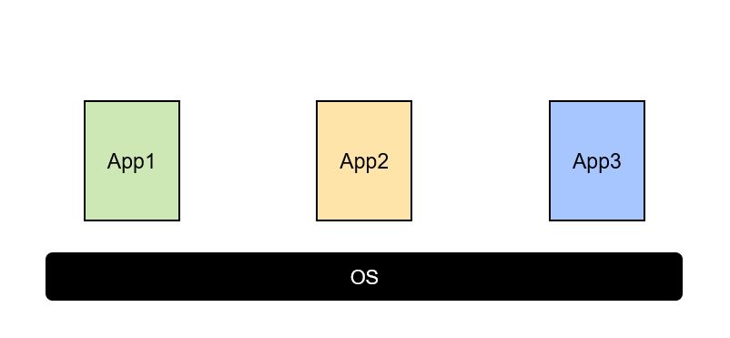

# Docker 기초

## 도커의 배경

---

### 1. 실행환경 분리

---

1. **Bare Metal**

   

   서버 장치의 성능이 좋아짐에 따라, 현재 대부분의 서버는 하나의 서버에 다양한 애플리케이션을 실행시킨다.

   그러면서 각각에 어플리케이션을 하나의 환경에 맞춰야 하는 점, 그리고 각각의 어플리케이션 설정이 충돌나는 경우 등의 문제가 발생했다.

   이에 단일 장비에서 **가상화 기술과 같은 자원 격리**를 통해 **여러 개의 WAS와 애플리케이션을 구동하는 방식**이 활용된다.

   > Bare Metal 서버는 응답 시간에 민감한 게임서버나 입력/출력 집약적인 데이터베이스 용도로 사용

2. **Hypervisor 가상화**

   

   그래서 도입된 방법이 **Hypervisor(vmware, virtualBox 등)기반의 가상화** 방법이다. 하나의 서버 안에 가상의 컴퓨터 환경을 여러개 만들고 각각의 프로그램에 맞는 OS, 설정을 세팅하여 함께 사용하는 경우다.

   하지만, 초기 세팅도 쉽지 않고, 겨우 웹서버같은 어플리케이션 하나 돌리기 위해 **무거운 운영체제를 기존의 운영체제 위에 쌓는 것은 큰 Overhead를 유발**한다.

3. **Container Engine**

   

   그래서 나온 것이 컨테이너 개념이다. 컨테이너는 **리눅스 커널**의 기능을 활용한 것으로, **앱을 실행하기 위한 라이브러리와 실행파일들만 포함**하기 때문에 virtual machine에 비해 매우 가볍게 사용할 수 있다.

   이 **컨테이너 엔진 중 하나이며 널리 쓰이는 것이 Docker**이다.

   <aside>
   💡 컨테이너 구조는 실제 물리적 환경이나 특정 개발, 운영 환경에 영향을 받지 않고 **어디서든 동일하게 잘 작동**한다. 또한 매우 **가볍게 서버 위에서 독립적으로 프로그램을 실행**시킬 수 있기 때문에 널리 쓰이고 있다.

   </aside>

   또한 **확장/축소가 용이**하다. Scale out을 할 때 컨테이너만 추가하면 되기 때문이다. 따라서 MSA, Devops에 적합하다.

### 2. 이미지를 이용한 동일 환경 제공

---

- 이미지만 있다면, 어떤 서버 환경에도 구애받지 않고 동일한 환경으로 어플리케이션을 실행할 수 있다.

즉, 정리하면 도커를 사용하게 된 배경은 다음과 같다.

1. 각각의 애플리케이션에 **독립적인 실행환경**을 제공
2. 실행환경 분리에 드는 자원이 매우 작아 **서버의 효율 극대화**
3. 서버 환경, 설정 등 **다양한 작업환경에 구애받지 않아 배포가 자유로워 질 수 있고, 빠른 배포가 가능**해졌다.

## 컨테이너(Linux)

---

- 컨테이너는 **프로세스를 격리된 공간에서 동작하게 만드는 기술**이다.
- **리눅스 커널이 제공하는 기능 위에 빌드**된다. (cgroups, namespace등)
- 가상 머신과는 달리 별도의 운영체제를 요구하지 않는다.
  대신, **(리눅스)커널의 기능에 의존한다.**
- 리소스 격리(CPU, 메모리, Block I/O, 네트워크 등) 및 격리된 이름공간을 사용하여 운영체제에 대한 응용 프로그램의 관점을 격리시킨다.
  - **chroot → 독립된 공간 형성**
  - **namespace → isolate 기능지원**
  - **cgroup → 필요한만큼 HW 지원**

### 도커 컨테이너 실행환경

도커는 Linux kernel 기반의 컨테이너 기술을 사용하기 때문에 **Linux에서만 동작**한다. 하지만 window나 MacOS도 이 도커를 사용할 수 있는 이유는 도커가 알아서 가상으로 Linux를 띄워주기 때문이다.

<aside>
💡 정확히는 **Hypervisor를 활성화 시켜서 가상 환경에 리눅스 커널**을 띄워주고, 그 위에 컨테이너를 실행시키는 것이다. 리눅스는 이런 작업이 필요없기 때문에 서버의 OS로 원도우나 Mac이 아닌 리눅스를 사용한다.

</aside>

### 장점

- CPU나 메모리를 딱 프로세스가 필요한 만큼만 추가로 사용하고, 성능적으로도 손실이 없다.
- VM으로 할 수 있었던 거의 모든것들을 할 수 있다.
  - 컨테이너 간 **독립적인 실행**
  - 실행중인 컨테이너에 접속하여 명령어 입력 가능
    - apt-get, yum으로 패키지 설치가능
    - 사용자 추가 가능
  - 여러개의 프로세스를 백그라운드로 실행 가능
  - CPU, 메모리 사용량을 제한할 수 있음
  - Host의 특정 디렉토리를 내부 디렉토리인 것처럼 사용 가능

## 이미지

---

### 이미지 생성 과정

이미지는 2가지 방법으로 생성 가능하다.

1. Container를 `commit`하여 생성 : 주로 백업의 용도로 쓰인다.
2. DockerFile을 만들어서 `Build`: 내 어플리케이션을 Layer로 나눠서 생성

첫번째 사진은 **컨테이너의 구조**를 나타낸다. node.js기반으로 실행되는 소스코드app.js, 그리고 해당 코드를 실행하는 명령어가 있다.

이 컨테이너의 요소를 **계층(Layer)별로 이미지를 만든다.** 첫번째는 기반이 되는 nodejs를 base image로, 두번째는 소스코드인 app.js를 source image로, 마지막으로 실행시키는 코드들의 모음들을 이미지로 저장한다.

마지막 사진은 시스템 관점으로 본 것이다. Layer 각각의 이미지 파일명을 UUID로 저장하고, 도커 이미지명은 가장 상단의 Layer의 UUID로 저장하여 도커의 File System을 구축한다.

### 컨테이너와 이미지의 차이

---

- **Image**
  - Disk에 File형태로 저장된 것을 의미한다. (각 Layer마다 파일이 존재)
  - Read Only
- **Container**
  - Image를 실행하여 메모리에 컨테이너로 하나의 Process로 running중인 것
  - Read and write

### 컨테이너 사용 흐름

---

프로그램을 app store에서 다운받고 그 것을 실행시켜서 process로 동작을 수행하는 것과 비슷하게, **docker hub에서 Image를 다운(Pull)받고, 그 Image를 실행(run)하면 container를 생성**하여 원하는 작업을 수행할 수 있다.

위의 사진은 docker hub 공식 홈페이지이다. 기업은 기업 자체의 docker hub를 사용하기도 한다.

docker hub에서 원하는 이미지를 찾고, pull명령어로 해당 이미지를 다운 받을 수 있다.

**명령어 모음**

- `docker pull 이미지이름` : 이미지 다운로드
- `docker images` : 이미지 목록 확인
- `docker rmi [이미지이름]` : 도커 이미지 삭제

## 명령어 모음

---

### 컨테이너(Container)

---

컨테이너는 이미지에 run명령을 통해 만들 수 있다. 이때 하나의 이미지로 여러 컨테이너를 생성할 수 있기 때문에 이름을 잘 지정해주는 것이 좋다.

**명령어 모음**

- `docker run [Options] Image [Command] [ARG….]` : 이미지로 컨테이너 생성 및 실행
  - `docker run —name 이름 이미지이름` : 컨테이너 이름 지정해서 실행
- `docker ps` : 실행중인 컨테이너 목록 확인
- `docker ps -a` : 모든 컨테이너 목록 확인
- `docker stop 컨테이너이름(or ID)` : 컨테이너 중지
- `docker start 컨테이너이름(or ID)` : 중지된 컨테이너 실행
- `docker logs 컨테이너이름(or ID)`: 로그를 화면에 출력하도록 설정
- `docker rm 컨테이너이름(or ID)` : 컨테이너 삭제(실행 중지 후 삭제 가능)
  - `docker rm —force 컨테이너이름` : 실행 중지 안하고 강제로 삭제

### 네트워크 환경

---

기존 환경에서의 네트워크 환경은 다음과 같다.

웹서버는 80포트로 요청을 받고, 요청이 들어오면 파일 시스템에서 index.html을 반환해준다.

도커 컨테이너로 웹 서버를 구축하면 다음과 같이 요청을 처리한다. Host의 포트와 컨테이너의 포트를 포워딩해주어서 웹 요청을 받게된다.

이때, 명령어의 앞의 포트 번호, 즉 Host의 포트번호를 8000번으로 변경하면 8000번과 컨테이너의 80포트가 연결이 될 것이고, 웹 브라우저에서 요청도 8000번으로 보내줘야 한다. 컨테이너의 80번 포트는 이미지를 만드는 사람이 지정해 둔 것이다.

run의 -p옵션으로 포트포워딩을 수행할 수 있다.

### 컨테이너 내부에서 명령어 실행

---

`docker exec -it 컨테이너명 /bin/bash`

-i옵션은 뒤의 bash로 명령어 실행 STDIN을 유지시켜주는 옵션이다. -t옵션을 같이 사용해주면 좋다. 만약 이미지에 bash가 없는 경우 기본 쉘인 /bin/sh를 사용하면 된다.

이제 컨테이너 내부에서 파일 수정 등 편집을 수행할 때 vim이나 nano같은 편집기를 사용해야 하는데, 컨테이너의 특성 상 이런것들은 깔려있지 않으므로 apt같은걸로 깔아서 사용한다.

### Host와 컨테이너의 File System 연결

---

위와 같이 직접 컨테이너 내부에서 파일을 수정하면 컨테이너를 삭제하면 기껏 작업한 것이 날라갈 것이다.

따라서 Host와 컨테이너의 File System을 연결하고, Host의 파일을 수정하면 컨테이너에 적용되도록 하면 위의 문제를 해결 할 수 있다.

`docker run -p 8888:80 -v ~/Desktop/htdocs:/usr/local/apache2/htdocs/httpd`

-v : 뒤의 명령어에서 :앞이 Host의 디렉토리 경로이고, 뒤에가 컨테이너 내부의 파일 시스템이다.

## 참고자료

[생활코딩 Docker 입문수업 - 1. 수업소개](https://www.youtube.com/watch?v=Ps8HDIAyPD0&list=PLuHgQVnccGMDeMJsGq2O-55Ymtx0IdKWf)

[docker run](https://docs.docker.com/engine/reference/commandline/run/)

[민첩한 클라우드 환경 구성 필수품 '컨테이너' (1)](https://datanet.co.kr/news/articleView.html?idxno=131759)
