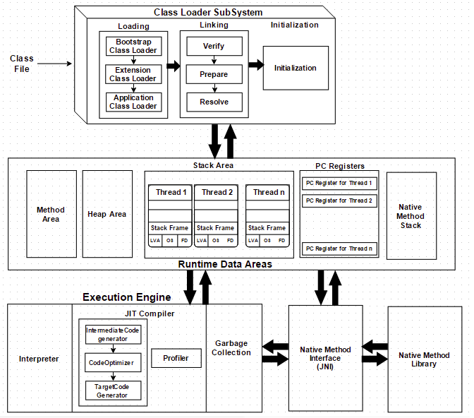
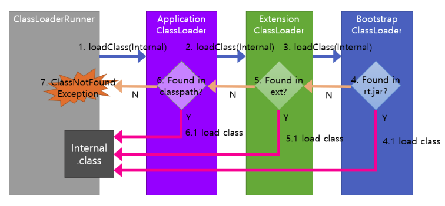
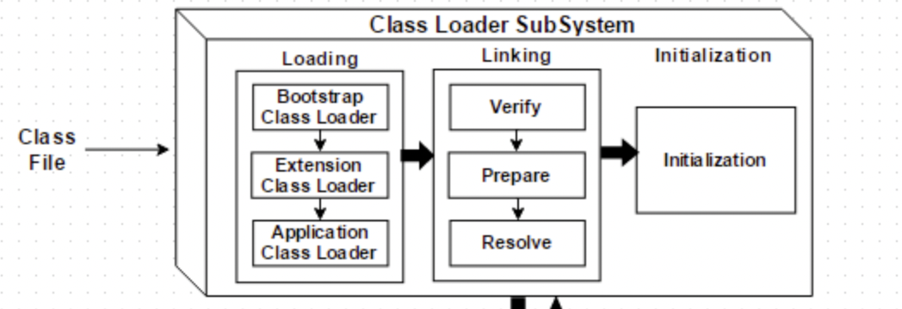
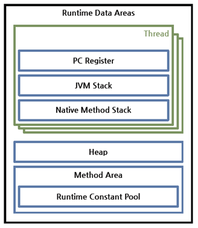
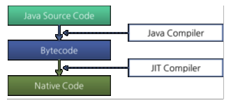

# JVM(Java Virtual Machine)

지난 시간에 JVM을 공부하기에 앞서 JAVA의 컴파일 과정에 대해서 알아 보았습니다.

이번 시간에는 JVM의 세부적인 구조와 역할에 대해 알아보겠습니다.

1. JVM 정의 : JAVA App을 실행하는 런타임 엔진 or 가상머신( = 물리적 머신을 구현한 소프트웨어)

   - 현재 자바 코드의 main method 를 호출함.
   - 컴파일된 자바 바이트 코드를 interpret하고 분석하고 실행함.

2. JVM 구조

   

   - 3개의 서브 시스템으로 구성되어있음.
   - Class Loader, Runtime Data Areas(JVM Memory), Exceution Engine

3. JVM Sub System

   1. Class Loader (**3을 기억하기!!**)

      - 정의 : JAVA Complier에 의해 컴파일 된 바이트 코드(.class)를 런타임 데이터 영역(JVM Memory)에 로드하는 시스템

      - JAVA는 동적 로드, 즉 컴파일타임이 아니라 런타임에 클래스를 처음으로 참조할 때 해당 클래스를 로드하고 링크하는 특징이 있다. 이 동적 로드를 담당하는 부분이 JVM 클래스 로더

      - 클래스 로더는 클래스 로드 시 **3가지 과정**을 거치는데 로딩(Loading), 연결(Linking), 초기화(initialize)의 과정을 거친다.

        1. 로딩(Loading)

           - 로딩에는 **3개**의 기본 클래스 로더가 참여한다.
           - JAVA 8에서 **3개**의 기본 클래스 로더는 다음과 같다.

           1. **BootStrap ClassLoader(부트스트랩 클래스로더)** : 3가지 기본 클래스로더 중 **최상위 클래스로더**, JVM 시직 시 최초로 실행되는 클래스 로더이다. JAVA 클래스를 로드하는 것이 아닌, 자바 클래스를 로드할 수 있는 자바 자체의 **클래스 로더와 최소한의 자바 클래스(java.lang.Object, Class, ClassLoader) 만 로드**한다. 이 내용들은 jre/lib.rt.jar에 담겨있다.

              ! 다른 클래스 로더와 다르게 자바가 아닌 **Native C로 구현**돼 있다. 때문에 String.class.getClassLoader()는 그냥 null을 반환한다.

              

           2. **Extension ClassLoader(확장 클래스로더)** : **부트스트랩 클래스로더를 부모**로 갖는다. **기본 자바 API 외 확장 자바 클래스들을 로드**한다. java.ext.dirs 환경 변수에 설정된 디렉토리의 클래스 파일을 로드하고, 이 값이 설정되러 있지 않은 경우 $ {JAVA_HOME}/jre/lib/ext 에 있는 클래스 파일을 로드한다. JAVA로 구현되어 있다.

           

           3. **System ClassLoader(시스템 클래스로더)** : 자바 프로그램 실행 시 지정한 Classpath에 있는 클래스 파일 혹은 jar에 속한 클래스들을 로드한다. 즉, **애플리케이션 클래스(사용자가 지정한 $CLASSPATH내의 클래스)들을 로드**한다. **JAVA로 구현**되어 있다.

           

           - 각 클래스 로더는 로드된 클래스들을 보관하는 네임스페이스(namespace)를 갖는다. 클래스를 로드할 때 이미 로드된 클래스인지 확인하기 위해서 네임스페이스에 보관된 FQCN(Fully Qualified Class Name)을 기준으로 클래스를 찾는다. 만약 FQCN이 같지만 네임스페이스가 다르다면 즉, 다른 클래스 로더가 로드한 클래스이면 다른 클래스로 간주된다. 

           

           4. 클래스 로드 작동 원칙 3가지 (위임 원칙, 가시 범위 원칙, 유일성 원칙)

              1. 위임 원칙 : 클래스 로더는 클래스 또는 리소스를 찾기 위해 요청을 받았을 때, 상위 클래스 로더에게 책임을 위임하는 위임 모델을 따름.

                 

                 예시로 `main()` 메서드가 포함된 `ClassLoaderRunner` 클래스 에서 개발자가 직접 작성한 `Internal` 클래스를 로딩하는 과정

                 1. `ClassLoaderRunner` 는 자기 자신을 로딩한 애플리케이션 클래스로더(=시스템 클래스로더)에게 `Internal` 클래스 로딩을 요청한다.
                 2. 클래스 로딩 요청을 받은 애플리케이션 클래스 로더는 `Internal` 을 스스로 직접 로딩한지 않고 상위 클래스로더인 확장 클래스로더에게 위임한다.
                 3. 클래스 로딩 요청을 받은 익스텐션 클래스로더도 `Internal`을 스스로 직접 로딩하지 않고 상위 클래스로더인 부트스트랩 클래스로더에게 위임한다.
                 4. 부트스트랩 클래스로더는 `rt.jar` 에서 `Internal`을 찾아서
                    1. 있으면 로딩 후 반환하고
                 5. 없으면 확장 클래스로더가 `jre/lib/ext/` 폴더나 `java.ext.dirs` 환경 변수로 지정된 폴더에서 `Internal`을 찾아서
                    1. 있으면 로딩 후 반환하고
                 6. 없으면 애플리케이션 클래스로더가 `classpath`에서 `Internal`을 찾아서
                    1. 있으면 로딩 후 반환하고
                 7. 없으면. `ClassNotFoundException`이 발생한다.

                 이런 식으로 동작하는 이유는 두 번째 원칙 가시 범위 원칙과 관련이 있다.

                 

              2. 가시 범위 원칙 : 하위 클래스로더는 상위 클래스로더가 로딩한 클래스를 볼 수 있지만, 상위 클래스로더는 하위 클래스 로더가 로딩한 클래스를 볼 수 없다.

                 - 이유 : 클래스 로더를 계층 구조로 만들었기에 이 원칙이 없으면 계층 구조가 없는 클래스 로더가 되는것과 마찬가지이고 그러면 계층 없이 모든 것을 읽어와야한다.

                 - 예 : 개발자가 만든 클래스를 로딩하는 애플리케이션 클래스로더가 부트스트랩 클래스로더에 의해 로딩된 `String.class`를 볼 수 없다면 애플리케이션은 `String.class`를 사용할 수 없을 것이다. 따라서 하위에서는 상위를 볼 수 있어야 애플리케이션이 제대로 동작할 수 있다.

                 - 마찬가지로 상위에서도 하위를 볼 수 있다면 상/하위 구분이 사실상 없어진다. 클래스로더를 3가지로 나눈 이유가 있을텐데 상위가 하위를 볼 수 있으면 구분 의미가 희석돼버린다.

                   따라서 하위에서는 상위를 볼 수 있지만 상위에서는 하위를 볼 수 없어야 한다.

                   

              3. 유일성 원칙 : 하위 클래스 로더는 상위 클래스 로더가 로딩한 클래스를 다시 로딩하지 않게 해서 로딩된 클래스의 유일성을 보장해야 한다.

                 

              

        2. 연결(Linking)

           - 초기화(initialize)전 3가지 과정을 거친다.

           1. 검증(Verifying): 읽어 들인 클래스가 자바 언어 명세(Java Language Specification) 및 JVM 명세에 명시된 대로 잘 구성되어 있는지 검사한다. 클래스 로드의 전 과정 중에서 가장 까다로운 검사를 수행하는 과정으로서 가장 복잡하고 시간이 많이 걸린다. JVM TCK의 테스트 케이스 중에서 가장 많은 부분이 잘못된 클래스를 로드하여 정상적으로 검증 오류를 발생시키는지 테스트하는 부분이다.

           2. 준비(Preparing): 클래스가 필요로 하는 메모리를 할당하고, 클래스에서 정의된 필드, 메서드, 인터페이스들을 나타내는 데이터 구조를 준비한다.

           3. 분석(Resolving): 클래스의 상수 풀 내 모든 심볼릭 레퍼런스를 다이렉트 레퍼런스로 변경한다.

              

        3. 초기화(initialize)

           - 클래스 변수들을 적절한 값으로 초기화한다. 즉, static initializer들을 수행하고, static 필드들을 설정된 값으로 초기화한다.

             

           

   2. Runtime Data Areas(JVM Memory)

      - 런타임 데이터 영역은 JVM이 운영체제 위에서 실행되면서 할당받는 메모리 영역이다. 6개의 영역으로 구성된다.

      - PC 레지스터(PC Register), JVM 스택(JVM Stack), 네이티브 메서드 스택(Native Method Stack)은 스레드마다 하나씩 생성된다.

      - 힙(Heap), 메서드 영역(Method Area), 런타임 상수 풀(Runtime Constant Pool)은 모든 스레드가 공유해서 사용한다.

        

      

      1. **힙 영역**

         런타임에 동적으로 할당되는 데이터가 저장되는 영역. 객체나 배열 생성이 여기에 해당함

      2. **스택 영역**

         지역변수, 매개변수, 메소드 정보, 임시 데이터 등을 저장

      3. **메서드 영역**

         JVM이 시작될 때 생성되고, JVM이 읽은 각각의 클래스와 인터페이스에 대한 런타임 상수 풀, 필드 및 메서드 코드, 정적 변수, 메서드의 바이트 코드 등을 보관함

      4. **PC 레지스터**

         스레드가 어떤 명령어로 실행되어야 할지 기록하는 부분(JVM 명령의 주소를 가짐)

      5. **네이티브 메서드 스택**

         실제 실행할 수 있는 기계어로 작성된 프로그램을 실행시키는 영역

         

   3. Exceution Engine(실행 엔진)

      - 클래스 로더를 통해 JVM 내의 런타임 데이터 영역에 배치된 바이트코드는 실행 엔진에 의해 실행된다. 실행 엔진은 자바 바이트코드를 명령어 단위로 읽어서 실행한다.

      - 실행 엔진은 이와 같은 바이트코드를 실제로 JVM 내부에서 기계가 실행할 수 있는 형태로 변경하며, 그 방식은 다음 두 가지가 있다.

        

      1. 인터프리터: 바이트코드 명령어를 하나씩 읽어서 해석하고 실행한다. 하나씩 해석하고 실행하기 때문에 바이트코드 하나하나의 해석은 빠른 대신 인터프리팅 결과의 실행은 느리다는 단점을 가지고 있다. 흔히 얘기하는 인터프리터 언어의 단점을 그대로 가지는 것이다. 즉, 바이트코드라는 '언어'는 기본적으로 인터프리터 방식으로 동작한다.

      2. JIT(Just-In-Time) 컴파일러: 인터프리터의 단점을 보완하기 위해 도입된 것이 JIT 컴파일러이다. 인터프리터 방식으로 실행하다가 적절한 시점에 바이트코드 전체를 컴파일하여 네이티브 코드로 변경하고, 이후에는 해당 메서드를 더 이상 인터프리팅하지 않고 네이티브 코드로 직접 실행하는 방식이다. 네이티브 코드를 실행하는 것이 하나씩 인터프리팅하는 것보다 빠르고, 네이티브 코드는 캐시에 보관하기 때문에 한 번 컴파일된 코드는 계속 빠르게 수행되게 된다.

         

      JIT 컴파일러가 컴파일하는 과정은 바이트코드를 하나씩 인터프리팅하는 것보다 훨씬 오래 걸리므로, 만약 한 번만 실행되는 코드라면 컴파일하지 않고 인터프리팅하는 것이 훨씬 유리하다. 따라서, JIT 컴파일러를 사용하는 JVM들은 내부적으로 해당 메서드가 얼마나 자주 수행되는지 체크하고, 일정 정도를 넘을 때에만 컴파일을 수행한다.

      

      

------

## Reference

1. [JVM Internal](https://d2.naver.com/helloworld/1230)
2. [[Java] JVM의 클래스 로더란?](https://steady-coding.tistory.com/593)
3. [JVM](https://www.nowwatersblog.com/cs/JVM)
4. [JVM 메모리 구조 및 아키텍쳐 (클래스 로더, 실행엔진 등)](https://sas-study.tistory.com/262)
5. [Java 클래스로더 훑어보기](https://homoefficio.github.io/2018/10/13/Java-%ED%81%B4%EB%9E%98%EC%8A%A4%EB%A1%9C%EB%8D%94-%ED%9B%91%EC%96%B4%EB%B3%B4%EA%B8%B0/)
6. [How JVM Works - JVM Architecture?](https://www.geeksforgeeks.org/jvm-works-jvm-architecture/)