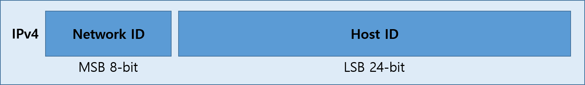
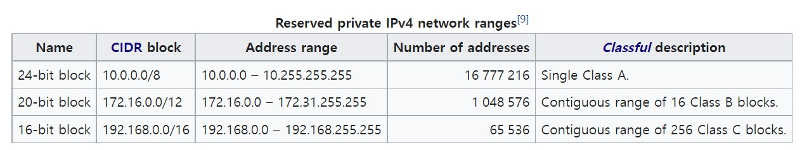
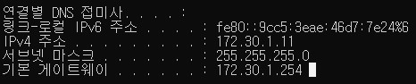

## IP Address

### 개요

#### 정의

> 인터넷 프로토콜(IP)을 사용하는 컴퓨터 네트워크에서 사용하는 일련 번호
>
> - **네트워크**와 **호스트**를 식별하는 기능

#### IPv4 (Internet Protocol version 4)

> IP의 4번째 버전; 1983년 ARPANET 이후로 현재까지 인터넷 트래픽의 대부분을 담당 중이다. 
>
> - 32비트 주소 공간을 사용한다. 
> - IPv4 주소 공간이 거의 가득 참에 따라서, IPv6 개발이 진행되었다. 

#### IPv4 표기법

> 주로 닷 데시멀 노테이션(Dot-decimal notation)으로 표기한다. 
>
> - Dot-decimal notation: 127.0.0.1

#### IANA (Internet Assigned Numbers Authority)

> 인터넷 할당 번호 관리 기관; IP 주소, 최상위 도메인 등을 관리한다. 

---

### Classful 주소 체계 (Addressing)

#### 초기 IP 주소 (~초기 개발 단계)

> 32비트 중에서 최상위 8비트는 네트워크 ID를, 최하위 24비트는 호스트의 ID를 표현
>
> - **이미지**
>
>   
>
> - **한계**
>
>   - 허용 가능한 네트워크의 수가 매우 제한된다. (254개)
>   - 확장성(Scalability)에 취약한 구조

#### Classful IP Addressing (~1993)

> - IP 주소를 클래스(계층)로 나누어서 관리하는 주소 체계
> - 각 클래스마다 정해진 규격이 존재한다. 
>
> | 구분        | Reserved bit(s) | Network ID bit(s) | Host ID bits |
> | ----------- | --------------- | ----------------- | ------------ |
> | **Class A** | 1 (0)           | 7                 | 24           |
> | **Class B** | 2 (10)          | 14                | 16           |
> | **Class C** | 3 (110)         | 21                | 8            |
> | **Class D** | 4 (1110)        | -                 | -            |
> | **Class E** | 4 (1111)        | -                 | -            |
>
> 
>
> - **Class A, B, C**
>
>   
>
>   
>
>   
>
> - **특수한 IP 주소**
>
>   - 169.254.0.0 ~ 169.254.0.16
>     - 링크 로컬 주소 (Link local address)
>   - 127.0.0.0 ~ 127.0.0.8
>     - Loop-back을 위한 주소 (현재 단말 장치에서 전송한 신호가, 다시 현재 단말 장치로 돌아온다. )
>   - 0.0.0.0 ~ 0.0.0.8
>     - 현재 네트워크와 통신하기 위한 주소
>
> 
>
> - **Host ID 제약 사항**
>   - 네트워크 내에서 각 Host ID는 유일해야 한다. 
>   - Host ID의 비트가 모두 0인 IP 주소는, 네트워크 자체를 가리킨다. 
>   - Host ID의 비트가 모두 1인 IP 주소는, 브로드캐스트를 위한 주소이다. 
>
> - **Network ID 제약 사항**
>   - 127로 시작하는 IP 주소는 loop-back에 사용된다. (신호를 전송한 장치로 다시 돌려보낸다. )
>   - Network ID의 비트가 모두 1인 IP 주소는, 브로드캐스트를 위한 주소이다. 
>   - Network ID의 비트가 모두 0인 IP 주소는, LAN 내의 특정 호스트를 지칭하며 라우팅되지 않는다. 
>
> 
>
> - **사설망(Private Network)을 위한 IP 주소**
>
>   
>
> - **내 PC의 ipconfig**
>
>   

#### 한계

> - Class A, B의 주소는 낭비가 심하며, Class C의 주소는 모자란 경우가 많다. 
> - 1993년 Classless Inter-Domain Routing(CIDR) 방식으로 대체하게 된다. 
>   - Variable-length subnet masking(VLSR)에 기반한 방식

---

### 부분망 (Subnetwork)

#### 개요

> - 네트워크 내에 존재하는 네트워크
> - 네트워크를 더 효율적으로 관리하기 위해 존재한다. 
>
> 

---

### 더 다루면 좋을 내용

- 서브넷 마스크 (Subnet mask)
  - CIDR (Classless Inter-Domain Routing)
  - VLSM (Variable-Length Subnet Masking)
- ARP (Address Resolution Protocol)
- DHCP (Dynamic Host Configuration Protocol)
- 공인 IP, 사설 IP
- NAT (Network Address Translation)

---

### Reference

- [Classful network - Wikipedia](https://en.wikipedia.org/wiki/Classful_network)
- [Introduction of Classful IP Addressing - GeeksforGeeks](https://www.geeksforgeeks.org/introduction-of-classful-ip-addressing/)
- [IP address - Wikipedia](https://en.wikipedia.org/wiki/IP_address)
- [Subnetwork - Wikipedia](https://en.wikipedia.org/wiki/Subnetwork)
- [Loopback - Wikipedia](https://en.wikipedia.org/wiki/Loopback)