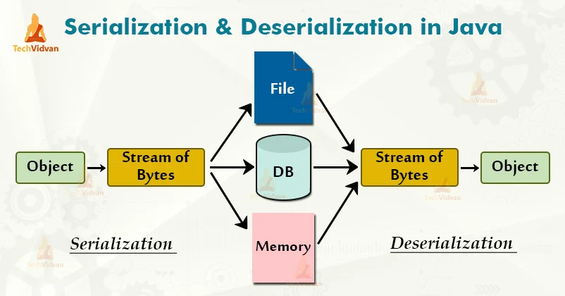

# 자바 직렬화(Serialization)

### 직렬화 \***\*Serialization\*\***

자바 시스템 내부에서 사용되는 객체 또는 데이터를 **외부의 자바 시스템에서도 사용할 수 있도록 바이트(byte) 형태로 데이터 변환하는 기술**

- 각자 PC의 OS마다 **서로 다른 가상 메모리 주소 공간**을 갖기 때문에 **Reference Type의 데이터들은 인스턴스를 전달 불가**

→ 주소값이 아닌 **Byte 형태로 직렬화된 객체 데이터를 전달 필요**

- 직렬화된 데이터들은 모두 **Primitive Type(기본형)**이 됨

→ **파일 저장이나 네트워크 전송 시 파싱이 가능한 유의미한 데이터**

⇒ 쉽게 말해 **직렬화 = 전송 및 저장이 가능한 데이터로 만들어주는 것**

---

### 역직렬화 **Deserialization**

직렬화된 파일 등을 역으로 직렬화하여 **다시 객체의 형태로 변환하는 기술**

---

### 직렬화 - 역직렬화 흐름

---

### **자바 직렬화 구현**

`java.io.Serializable` 인터페이스 구현으로 직렬화/역직렬화가 가능

→ `serialVersionUID`를 만들어준다.

→ `ObjectOutputStream`으로 직렬화를 진행

→`ObjectInputStream`으로 역직렬화를 진행

---

### \***\*serialVersionUID\*\***

직렬화하는 데 사용되는 **식별자**

→ Serializable 클래스의 버전을 기억하여 **로드된 클래스와 직렬화된 객체가 호환되는지 확인**

- 선언하지 않아도 자동으로 해시값이 할당

→ 그러나 **기존의 클래스 멤버 변수가 변경되면 serialVersionUID가 달라지는데**, 역직렬화 시 달라진 넘버로 **Exception이 발생**

⇒ 직접 serialVersionUID를 설정하여 예외 발생 방지

---

### 직렬화 사용 상황

- **서블릿 세션**
  **세션을 파일로 저장하거나 세션 클러스터링, DB를 저장**하는 경우 세션 자체가 직렬화가 되어 전달됨
  → 세션에 필요한 객체는 `java.io.Serializable` 인터페이스를 구현하는 것이 좋음
- **캐시**
  **Encache, Redis, memcached 등의 라이브러리 시스템에서 캐시할 부분을 자바 직렬화된 데이터를 저장해서 사용**
  → 다른 직렬화 방식도 사용되지만, 자바 직렬화가 가장 간편해서 많이 사용됨
- **자바 RMI**(원격 시스템 간의 메시지 교환을 위해서 사용하는 자바에서 지원하는 기술)
  원격 시스템의 메소드를 호출 시에 **전달하는 메시지를 작동으로 직렬화**하고, **전달받는 원격 시스템에서는 메시지를 역직렬화하여 사용**

---

### 직렬화 지양 상황

- 클래스 변경을 개발자가 예측할 수 없을 때는 직렬화 사용을 지양
- 개발자가 직접 컨트롤 할 수 없는 클래스(라이브러리 등)는 직렬화 사용을 지양
- 자주 변경되는 클래스는 직렬화 사용을 지양
