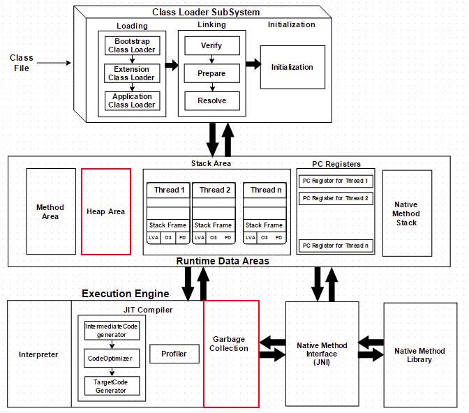
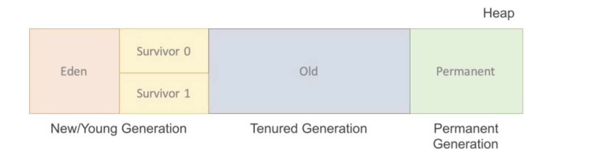
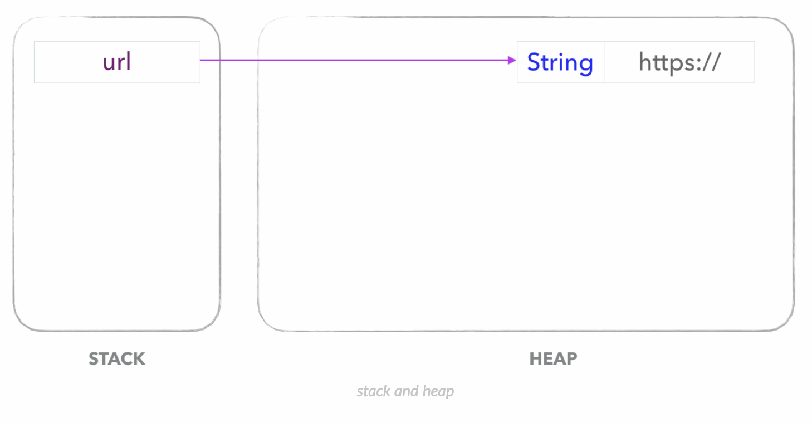
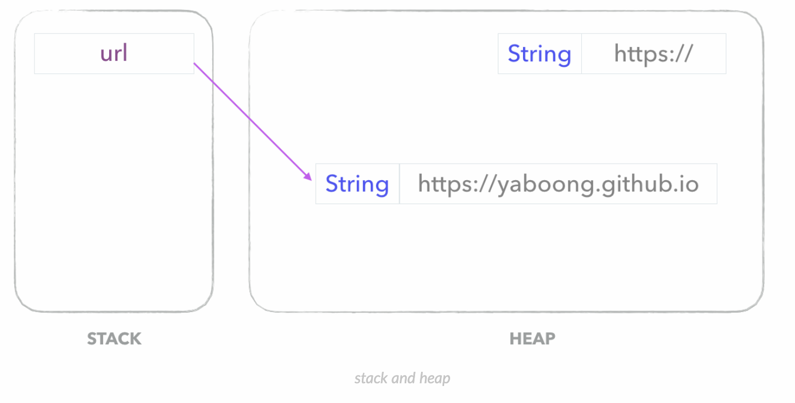
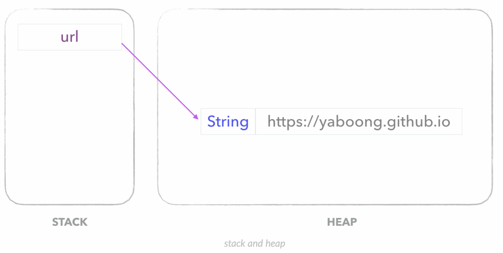

# JVM Heap과 GC 맛보기

JVM에서 메모리 관리를 담당하는 GC(Garbage Collection)에 대하여 알아본다.

GC에 대해 알아보기 앞서 GC의 대표적인 관리 대상인 힙(Heap)의 구조에 대해 더 자세히 알아보자




1. ## Heap

   - 정의 : 객체를 저장하는 가상 메모리 공간
   - 특징 : new 연산자로 생성된 객체와 배열을 저장한다.
   - 힙은 크게 3가지 부분으로 나눌 수 있다.



1. Permanent Generation
   - 생성된 객체들의 정보의 주소값이 저장된 공간.
   - Class loader에 의해 load되는 Class, Method 등에 대한 Meta 정보가 저장되는 영역, JVM에 의해 사용됨.
   - Reflection을 사용하여 동적으로 클래스가 로딩되는 경우에 사용됨.
   - 내부적으로 Reflection 기능을 자주 사용하는 Spring Framework 을 이용할 경우 이 영역에 대한 고려가 필요하다.
   - 여기서도 GC가 발생할 수 있으며 Major GC 횟수에 포함된다.
2. New/Young 영역
   - Eden : 객체들이 최초로 생성되는 공간
   - Survivor 0 / 1 : Eden에서 참조되는 객체들이 저장되는 공간
   - 이 영역에서 객체가 사라질 때 minor GC가 발생한다.
3. Old 영역
   - New area에서 일정 시간 참조되고 있는, 살아남은 객체들이 저장되는 공간
   - Eden 영역에 객체가 가득차게 되면 첫번째 GC(minor GC)가 발생한다. Eden영역에 있는 값들을 Survivor 1영역에 복사하고 이 영역을 제외한 나머지 영역의 객체를 삭제한다.
   - 이 영역에서 객체가 사라질 때 Major GC가 발생한다.

인스턴스는 소멸 방법과 소멸 시점이 지역 변수와 다르기에 힙이라는 별도의 영역에 할당된다. 자바 가상 머신은 매우 합리적으로 인스턴스를 소멸시킨다. 더이상 인스턴스의 존재 이유가 없을 때 소멸시킨다.

------

2. ## Garbage Collection

자바에서 메모리 누수현상을 방지하는 하나의 방법이다.

프로그래머는 힙을 사용할 수 있는 만큼 자유롭게 사용하고, 더 이상 사용되지 않는 오브젝트들을 GC를 담당하는 프로세스가 자동으로 메모리에서 제거하도록 하는 것이 GC의 기본 개념이다.

Java의 GC는 단순한 규칙으로 적용된다.

**Heap 영역의 오브젝트 중 Stack 에서 도달 불가능한(Unreachable) 오브젝트들은 GC의 대상이 된다.**


### Garbage Collection 살짝 겉핥아보기

이제 간단한 코드를 살펴보면서 garbage collection 이 뭔지 살짝만 알아보자.

```java
public class Main {
    public static void main(String[] args) {
        String url = "https://";
        url += "yaboong.github.io";
        System.out.println(url);
    }
}
```

위 코드에서

```java
String url = "https://";
```

구문이 실행된 뒤 스택과 힙은 아래와 같다.



다음 구문인

```java
url += "yaboong.github.io";
```

문자열 더하기 연산이 수행되는 과정에서, (String 은 불변객체이므로) 기존에 있던 "https://" 스트링에 "yaboong.github.io" 를 덧붙이는 것이 아니라, 문자열에 대한 더하기 연산이 수행된 결과가 새롭게 heap 영역에 할당된다. 그 결과를 그림으로 표현하면 아래와 같다.



Stack 에는 새로운 변수가 할당되지 않는다. 문자열 더하기 연산의 결과인 "[https://yaboong.github.io](https://yaboong.github.io/)" 가 새롭게 heap 영역에 생성되고, 기존에 "https://" 를 레퍼런스 하고 있던 url 변수는 새롭게 생성된 문자열을 레퍼런스 하게 된다.

> 기존의 "https://" 라는 문자열을 레퍼런스 하고 있는 변수는 아무것도 없으므로 Unreachable 오브젝트가 된다.

JVM 의 Garbage Collector 는 **Unreachable Object 를 우선적으로 메모리에서 제거하여 메모리 공간을 확보**한다. Unreachable Object 란 Stack 에서 도달할 수 없는 Heap 영역의 객체를 말하는데, 지금의 예제에서 "https://" 문자열과 같은 경우가 되겠다. 아주 간단하게 이야기해서 이런 경우에 **Garbage Collection 이 일어나면 Unreachable 오브젝트들은 메모리에서 제거**된다.

Garbage Collection 과정은 **Mark and Sweep** 이라고도 한다. JVM의 Garbage Collector 가 **스택의 모든 변수를 스캔하면서 각각 어떤 오브젝트를 레퍼런스 하고 있는지 찾는과정이 Mark** 다. **Reachable 오브젝트가 레퍼런스하고 있는 오브젝트 또한 marking** 한다. 첫번째 단계인 **marking 작업을 위해 모든 스레드는 중단되는데 이를 stop the world** 라고 부르기도 한다. (System.gc() 를 생각없이 호출하면 안되는 이유이기도 하다)

그리고 나서 **mark 되어있지 않은 모든 오브젝트들을 힙에서 제거하는 과정이 Sweep** 이다.

Garbage Collection 이라고 하면 garbage 들을 수집할 것 같지만 **실제로는 garbage 를 수집하여 제거하는 것이 아니라**, **garbage 가 아닌 것을 따로 mark 하고 그 외의 것은 모두 지우는 것**이다. 만약 힙에 garbage 만 가득하다면 제거 과정은 즉각적으로 이루어진다.

Garbage Collection 이 일어난 후의 메모리 상태는 아래와 같을 것이다.




------

### Reference

- [자바가상머신, JVM(Java Virtual Machine)이란 무엇인가?](https://asfirstalways.tistory.com/158)
- [가비지컬렉션(Garbage Collection) / JVM 구동원리에 이어서](https://asfirstalways.tistory.com/159)
- [Java Garbage Collection](https://d2.naver.com/helloworld/1329)
- [Garbage Collection 모니터링 방법](https://d2.naver.com/helloworld/6043)
- [Garbage Collection 튜닝](https://d2.naver.com/helloworld/37111)
- [자바 메모리 관리 - 가비지 컬렉션](https://yaboong.github.io/java/2018/06/09/java-garbage-collection/)