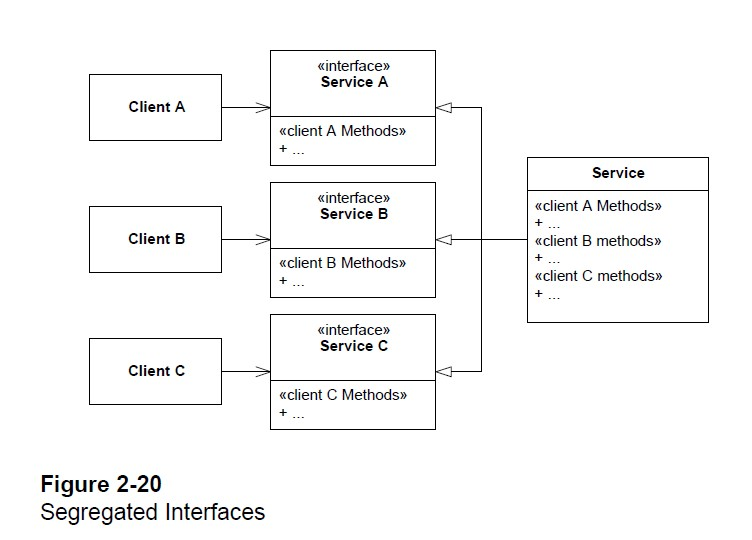
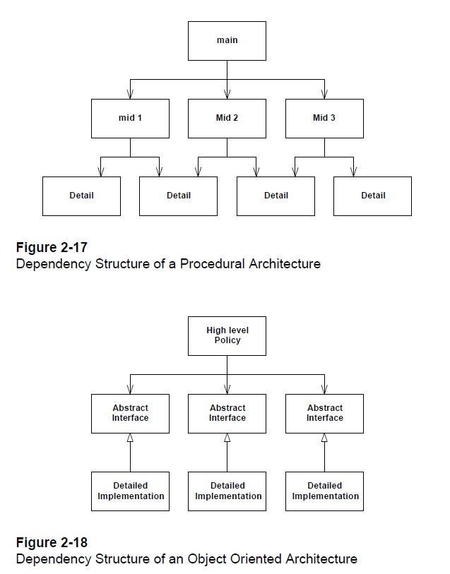

## 객체 지향 5원칙 (SOLID)

### 개요

#### 배경

- 소프트웨어를 **설계**하고, **개발**하고, 처음으로 **배포**하는 단계까지는 보통 잘 이루어진다. 
- 이후 소프트웨어는 썩어가기 시작한다. 
  - 전체 소프트웨어의 설계도를 지배할 때까지
- **유지 보수** 단계에서 기능 하나를 수정할 때조차 굉장히 큰 노력을 기울여야 한다. 
  - 이후에 소프트웨어 재설계를 하고자 하여 진행하지만, 보통 실패한다. 

#### 증상

1. **강직성 (Rigidity)**

   - 소프트웨어가 변경하기 어려운 경향성을 띄는 것
     - 하나의 클래스를 수정할 때, 연쇄적으로 여러 다른 클래스를 수정해야 하는 경우
   - 이 때, 관리자들은 엔지니어에게 중요하지 않은 문제를 고치게 하지 않으려는 경향성을 띈다고 합니다. 
     - 엔지니어들이 고치러 가서 돌아오지 않기 때문에...

2. **취약성 (Fragility)**

   - 소프트웨어의 한 부분을 수정하였을 때, 소프트웨어의 여러 부분이 고장나는 경향성을 띄는 것
   - 이 때, 관리자들은 엔지니어의 수정 사항을 인가해주는 것을 두려워 한다고 합니다. 
     - 하나 인가해줬다가, 다수의 버그를 발견하기 때문에...

3. **부동성 (Immobility)**

   - 소프트웨어가 재사용하기 어려운 경향성을 띄는 것
     - 다른 프로젝트나, 같은 프로젝트 내 다른 모듈에서 재사용하고자 하는 경우
   - 이 때, 엔지니어들은 주로 다시 코드를 작성한다고 합니다. 
     - 해당 소프트웨어에서 재사용 가능한 부분을 분리(추상화)해서 사용하기보다...

4. **점성 (Viscosity)**

   - 서로 떨어지지 않으려는 성질
   - 디자인(설계도)과의 점성
     - 설계도를 수정하지 않으며 소프트웨어를 수정하기 어려울 때, 이를 점성이 높다고 한다. 

   - 환경과의 점성
     - 개발 환경이 느리고 비효율적일 때 환경과의 점성이 생긴다. 

#### 원인

1. **변화하는 요구사항**
   - 요구사항에 맞게 적절한 디자인(설계도)을 사용해야 한다. 
   - 적절하지 않은 경우, 요구사항이 변화할수록 소프트웨어가 썩어가기 시작한다. 
2. **의존성 관리**
   - 앞서 설명된 증상들은, 주로 부적절한 의존성 관리에서 발발한다. 

---

### 단일 책임 원칙 (The Single-Responsibility Principle; SRP)

- *THERE SHOULD NEVER BE MORE THAN ONE REASON FOR A CLASS TO CHANGE.*

#### 개요

- 하나의 클래스는 오직 하나의 책임을 가져야 한다. 
  - 책임은, "변해야 하는 이유"라고 정의할 수 있다. 
  - 클래스가 변해야 하는 이유를 둘 이상 댈 수 있다면, 둘 이상의 책임을 갖는 클래스이다. 
- 가장 간단한 원칙 중 하나인 동시에, 가장 지키기 어려운 원칙 중 하나라고 한다. 

---

### 개방-폐쇄 원칙 (The Open Closed Principle; OCP)

- *A module should be open for extension but closed for modification.*

#### 개요

- **Open** - (기능) 확장에 열려 있어야 한다. 
- **Closed** - (소스 코드) 수정에 닫혀 있어야 한다. 
- 모듈의 소스 코드를 수정하지 않은 채, 모듈이 하는 동작을 수정할 수 있어야 한다. 
- OOP의 **추상화**(Abstraction)가 OCP의 핵심

#### 목적

- 새로운 기능이 추가되더라도, 기존에 존재하던 소스 코드의 수정을 최소화
  - 부분적으로 OCP를 적용하는 것도, 어플리케이션 구조를 크게 향상시킨다. 

---

### 리스코프 치환 원칙 (The Liskov Substitution Principle; LSP)

- *Subclasses should be substitutable for their base classes.*

#### 개요

- 자식 클래스는 부모 클래스로 치환이 가능하다. 

  - **조건 중 일부**
    1. 재정의한 메서드의 접근제어자는 기존 메서드의 접근 제어자보다 더 private할 수 없다. 
    2. 재정의한 메서드가 던지는 에러는 기존 메서드가 던지는 에러보다 더 좁거나 같은 범위에서 가능하다. 

- 코드

  ```java
  class Parent {
      void go() throws Exception {
          System.out.println("Parent do something");
          return;
      }
  }
  
  class Child extends Parent {
      @Override
      public void go() throws java.io.IOException {
          System.out.println("Child do something");
          return;
      }
  }
  
  public class Test {
      public static void main(String[] args) {
          Parent p = new Child();
          try {
              p.go();
          }
          catch(Exception e) {
              e.printStackTrace();
          }
      }
  }
  ```

#### Circle-Ellipse Dillema

- **설명**

  - 수학적으로, 타원은 원을 포함하는 개념
  - OOP에서 타원을 부모 클래스로, 원을 자식 클래스로 구현 시에 LSP를 위반하게 된다. 

- **코드**

  ```java
  import java.awt.Point;
  
  class Ellipse {
  	
  	/**	타원의 초점 1, 2 */
  	Point focus1;
  	Point focus2;
  	/** 초점 1, 2와의 거리 */
  	int distance;
  	
  	public void setFocus(Point focus1, Point focus2) {
  		this.focus1 = focus1;
  		this.focus2 = focus2;
  	}
  	
  	public void setDistance(int distance) {
  		this.distance = distance;
  	}
  }
  
  class Circle extends Ellipse {
      
  	@Override
  	public void setFocus(Point focus1, Point focus2) {
  		this.focus1 = focus1;
  		this.focus2 = focus1;
  	}
  	
  	@Override
  	public void setDistance(int distance) {
  		super.setDistance(distance);
  	}
  }
  
  public class Client {
      public static void main(String[] args) {
      	Client client = new Client();
      	
          Circle c = new Circle();
          
      	client.f(c);
      }
      
      public void f(Ellipse e) {
      	Point a = new Point(1, 0);
      	Point b = new Point(0, 1);
      	e.setFocus(a, b);
      	e.setDistance(4);
      	
      	assert a == e.focus1;
      	assert b == e.focus2;
      	assert 4 == e.distance;
      }
  }
  ```

  - 자식 메서드의 전제 조건(precondition)은 부모 메서드의 전제 조건보다 같거나 약해야 한다. 
  - 자식 메서드의 사후 조건(postcondition)은 부모 메서드의 전제 조건보다 같거나 강해야 한다. 
    - 더 기대하지 않으며, 적게 제공하지 않는다. (*Expect no more, provide no less*)

---

### 인터페이스 분리 원칙 (The Interface Segregation Principle; ISP)

- *Many client specific interfaces are better than one general purpose interface*

#### 개요

- 하나의 클래스를 다른 여러 클래스에서 사용하는 경우
  - 다른 여러 클래스에 적합한 인터페이스를 각각 구현하여 사용한다. 

#### 이미지

- 

#### 주의 사항

- 둘 이상의 인터페이스에서 공통적으로 사용되는 메서드는, 전체 인터페이스에 정의해도 무방하다. 
- 적절하게 사용하는 것이 중요하다. (너무 많은 분리는 혼란을 야기)

---

### 의존성 역전 원칙 (The Dependency Inversion Principle; DIP)

- *Depend upon Abstractions. Do not depend upon concretions.*

#### 개요

- 개방-폐쇄 원칙이 객체 지향 구조의 목적이라면, 의존성 역전 원칙은 도구
- 특정 클래스를 사용하고자 하는 경우, 구현체에 의존하지 않고 인터페이스 혹은 추상 클래스에 의존하는 전략
  - 예) Controller는 Service 인터페이스에 의존하며, 실제 사용 시에는 ServiceImpl 클래스를 생성하여 사용한다. 

#### 이미지

- 

#### 이유

- 구현체는 굉장히 자주 변경이 일어나지만, 추상적인 것은 자주 변경이 일어나지 않는다. 
- 변경이 자주 일어나는 구현체에 의존하는 것보다는, 추상적인 것에 의존한다. 
  - 구현체지만 변경이 자주 일어나지 않는 것들도 존재한다. 
    - 예) Java SE의 공식 라이브러리, ...

#### 주의 사항

- 추상적인 것에 의존하지만, 그것을 사용할 때에는 구현체 인스턴스를 생성하여 사용한다. 
  - 여기서 더 나아가서, 추상 팩토리 패턴(AbstractFactory)을 적용할 수 있다고 한다. 

---

### 마무리

- 객체지향 설계 5원칙, SOLID는 클래스-레벨의 설계에 대한 원칙들을 제시한다. 
  - 객체지향 설계 중에서, 패키지-레벨의 설계에 대한 원칙들도 있다. 
  - 유연 / 강인 / 재사용 가능 / 개발이 쉬운 어플리케이션을 위한 원칙!

---

### 참조

- [SOLID - Wikipedia](https://en.wikipedia.org/wiki/SOLID)
- Martin, Robert C. (2000). ["Design Principles and Design Patterns"](https://web.archive.org/web/20150906155800/http://www.objectmentor.com/resources/articles/Principles_and_Patterns.pdf) (PDF). Archived from [the original](http://www.objectmentor.com/resources/articles/Principles_and_Patterns.pdf) (PDF) on 2015-09-06.
- ["Single Responsibility Principle"](https://web.archive.org/web/20150202200348/http://www.objectmentor.com/resources/articles/srp.pdf) (PDF). *objectmentor.com*. Archived from [the original](http://www.objectmentor.com/resources/articles/srp.pdf) (PDF) on 2 February 2015.
- ["Open/Closed Principle"](https://web.archive.org/web/20150905081105/http://www.objectmentor.com/resources/articles/ocp.pdf) (PDF). *objectmentor.com*. Archived from [the original](http://www.objectmentor.com/resources/articles/ocp.pdf) (PDF) on 5 September 2015.
- ["Liskov Substitution Principle"](https://web.archive.org/web/20150905081111/http://www.objectmentor.com/resources/articles/lsp.pdf) (PDF). *objectmentor.com*. Archived from [the original](http://www.objectmentor.com/resources/articles/lsp.pdf) (PDF) on 5 September 2015.
- ["Interface Segregation Principle"](https://web.archive.org/web/20150905081110/http://www.objectmentor.com/resources/articles/isp.pdf) (PDF). *objectmentor.com*. 1996. Archived from [the original](http://www.objectmentor.com/resources/articles/isp.pdf) (PDF) on 5 September 2015.
- ["Dependency Inversion Principle"](https://web.archive.org/web/20150905081103/http://www.objectmentor.com/resources/articles/dip.pdf) (PDF). *objectmentor.com*. Archived from [the original](http://www.objectmentor.com/resources/articles/dip.pdf) (PDF) on 5 September 2015.