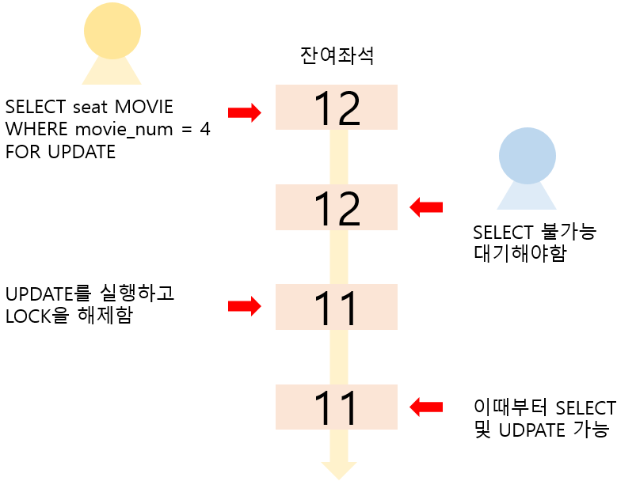
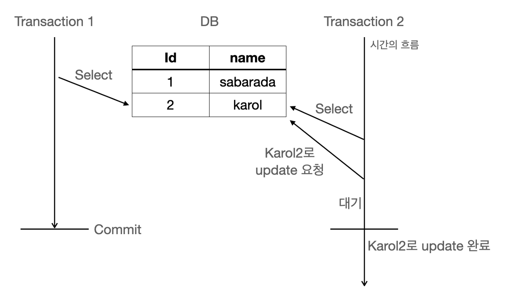

# 비관적 락과 낙관적 락

### 비관적 락 (Pessimisitc Lock)

- **동시성 문제가 발생할 것이라고 가정**하고 락을 거는 방법
- 하나의 트랜잭션이 자원에 접근시 락을 걸어 **다른 트랜잭션이 접근하지 못하게 함**
- **Repeatable read** 또는 **Serializable**정도의 격리성 수준에서 가능
- 트랜잭션이 시작될 때 **Shared Lock** 또는 **Exclusive Lock**을 걸고 시작
  
  비관적 락의 대표적인 예인 select for update 구문

**Shared Lock(공유 잠금, 읽기 잠금)** : 어떤 트랜잭션에서 데이터를 읽고자 할 때 다른 트랜잭션에서 **읽기는 가능하지만 쓰기는 불가능**, 또한 **Exclusive lock 적용은 불가능**(읽는 동안 변경하는 것을 막기 위해)

**Exclusive Lock(배타적 잠금, 쓰기 잠금)** : 어떤 트랜잭션에서 데이터를 변경하고자 할 때 다른 트랜잭션에서 **읽기, 쓰기가 둘다 불가능**, 또한 **Shared, Exclusive Lock 적용이 불가능**(쓰는 동안 읽거나, 다른 쓰기를 막기 위해)

### 예시

1. Transaction_1 에서 table의 Id 2번을 읽으면서 shared Lock을 걸음 ( name = Karol )
2. Transaction_2 에서 table의 Id 2번을 읽음 ( name = Karol )
3. Transaction_2 에서 table의 Id 2번의 name을 Karol2로 변경 요청 ( name = Karol )
   - 하지만 Transaction 1에서 이미 shared Lock을 잡고 있기 때문에 Blocking
4. Transaction_1 에서 트랜잭션 해제 (commit)
5. Blocking 되어있었던 Transaction_2의 update 요청 정상 처리

### 장점

- 충돌이 자주 발생하는 환경에 대해서는 **롤백의 횟수를 줄일 수 있으므로 성능에서 유리**
- **데이터 무결성**을 보장하는 수준이 매우 높음

### 단점

- 데이터 자체에 락을 걸어버리므로 **동시성이 떨어져 성능 손해가 큼,** 특히 **읽기가 많이 이루어지는 데이터베이스**의 경우에는 **손해가 더 두드러짐**
- 서로 자원이 필요한 경우에, 락이 걸려있으므로 **데드락이 일어날 가능성**이 생김

## 낙관적 락 (Optimistic Lock)

- 트랜잭션 대부분 **충돌이 발생하지 않는다고 낙관적으로 가정**하여 락을 거는 방법
- DB에서 제공해주는 특징을 이용하는 것이 아닌 **Application Level에서 잡아주는 Lock**
- **JPA에서는 @Version을 통해 엔티티에 버전 관리용 필드를 추가하여 낙관적 락을 사용**
  → **엔티티 수정(update)하면** **버전이 하나씩 자동으로 증가**하는데, 엔티티를 조회했을 때의 버전과 수정했을 때의 **버전이 다르다면 다른 트랜잭션에서 중간에 이미 엔티티를 수정한 것이기 때문에 예외가 발생**
- 일반적으로 version의 상태를 보고 충돌을 확인하며, **충돌이 확인된 경우 롤백을 진행**

→ 충돌이 발생하여 수정을 못한 부분에 대해서는 **롤백에 대한 책임을 Application단에서 지며 Application에서 롤백을 수동으로 해줘야 함**

1. A가 table의 Id 2번을 읽음 ( name = Karol, version = 1 )
2. B가 table의 Id 2번을 읽음 ( name = Karol, version = 1 )
3. B가 table의 Id 2번, version 1인 row의 값 갱신 ( name = Karol2, version = 2 ) 성공
4. A가 table의 Id 2번, version 1인 row의 값 갱신 ( name = Karol1, version = 2 ) 실패
   - Id 2번은 이미 version이 2로 업데이트 되었기 때문에 A는 해당 row를 갱신하지 못함

### **장점**

- 충돌이 안난다는 가정하에 **동시 요청에 대해서 처리 성능이 좋음**

### 단점

- 잦은 충돌이 일어나는경우 **롤백 처리에 대한 비용이 많이 들어 오히려 성능에서 손해**
- **롤백 처리 구현이 복잡**

## 결론

- **비관적 락**은 **데이터의 무결성이 중요하고, 충돌이 많이 발생하여 잦은 롤백으로 인한 효율성 문제가 발생하는것이 예상되는 시나리오**에 적합
- **낙관적 락**은 **실제로 데이터 충돌이 자주 일어나지 않을 것이라고 예상되는 시나리오**에 적합
