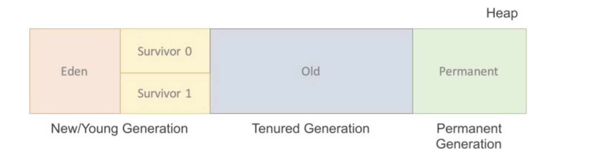
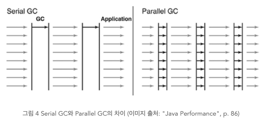
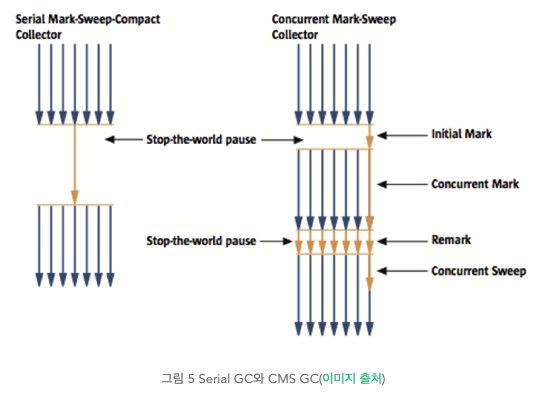
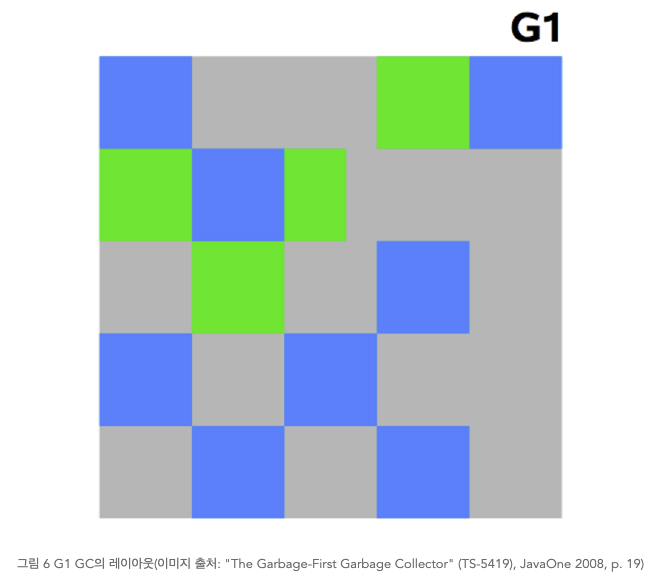

# GC (Garbage Collection)

지난 시간

1. ### JVM Heap 은 3가지 영역으로 구성되어 있다.

   1. Permanent Generation
   2. New/Young
   3. Old

2. ### Heap은 GC의 대표적 관리 대상이며 GC는 Heap 영역의 오브젝트 중 Stack에서 도달 불가능한 오브젝트들을 제거 대상으로 삼고 제거한다.

3. ### GC 과정은 Mark and Sweep 이다. JVM의 Garbage Collector는 

   1. ### Mark : 스택의 모든 변수를 스캔하면서 각각 어떤 오브젝트를 Heap에서 레퍼런스 하고 있는지를 찾는다. 

      1. 스택 -> Heap 인 오브젝트를 Reachable 오브젝트라 하며 marking 과정에서는 이 Reachable 오브젝트가 레퍼런스하고 있는 오브젝트도 marking 한다.
      2. marking 작업을 할 때는 모든 스레드가 중단된다 : stop the world

   2. ### Sweep : mark되어 있지 않은 모든 오브젝트들을 힙에서 제거하는 과정


## 오늘 알아볼 내용

1. ### Heap 영역에서 객체 생성 과정과 GC 과정

2. ### GC 종류와 특징




1. ### Heap 영역에서 객체 생성 과정

   1. 먼저 객체는 **처음 생성 시 New/Young 영역에 생성**된다.
      1. New/Young 영역에서 생성된 객체의 대부분은 금방 접근 불가능 상태가 된다.(=생성되었다 사라진다, **이 때 Minor GC가 발생**한다.)
   2. 생성되는 객체의 대부분은 New/Young 영역에서 **주로 Eden 영역에서 생성**된다.
      1. 처음 Eden 영역에서 생성될 때 **두 개의 Survivor 영역은 비워진 상태로 시작**한다.
   3. Eden 영역이 가득 차면 **MinorGC 가 발생**한다.
   4. MinorGC 가 발생하면, Reachable 오브젝트들은 S0 으로 옮겨진다. **Unreachable 오브젝트들은 Eden 영역이 클리어 될때 함께 메모리에서 사라진다.**
   5. 다음 MinorGC 가 발생할때, Eden 영역에는 4번과 같은 과정이 발생한다. Unreachable 오브젝트들은 지워지고, Reachable 오브젝트들은 Survivor Space 로 이동한다. 기존에 S0 에 있었던 Reachable 오브젝트들은 S1 으로 옮겨지는데, **이때, age 값이 증가되어 옮겨진다**. 살아남은 모든 오브젝트들이 S1 으로 모두 옮겨지면, **S0 와 Eden 은 클리어 된다**. Survivor Space 에서 Survivor Space 로의 이동은 이동할때마다 age 값이 증가한다.
   6. 다음 MinorGC 가 발생하면, 5번 과정이 반복되는데, S1 이 가득차 있었으므로 S1 에서 살아남은 오브젝트들은 S0 로 옮겨지면서 Eden 과 S1 은 클리어 된다. 이때에도, age 값이 증가되어 옮겨진다. Survivor Space 에서 Survivor Space 로의 이동은 이동할때마다 age 값이 증가한다.
   7. **Young Generation 에서 계속해서 살아남으며 age 값이 증가하는 오브젝트들은 age 값이 특정값 이상이 되면 Old Generation 으로 옮겨**지는데 이 단계를 **Promotion** 이라고 한다.
   8. MinorGC 가 계속해서 반복되면, Promotion 작업도 꾸준히 발생하게 된다.
   9. Promotion 작업이 계속해서 반복되면서 **Old Generation 이 가득차게 되면 MajorGC 가 발생**하게 된다.

   => Minor GC는 New/Young Generation에서 발생하는 GC이며

   ​		Eden -> Survivor

   ​		Survivor -> Old Generation 의 이동을 일으킨다.

   ​		살아남지 못한 객체는 MinorGC가 제거

   

2. ### Major GC

   1. Old Generation에서 발생하는 GC이며 Old 영역이 가득차면 실행된다.

   2. JDK 7 기준 5가지 방식이 존재한다.

      1. #### Serial GC

      2. #### Parallerl GC

      3. #### Parallel Old(Parallel Compactig GC)

      4. #### Concurrent Mark & Sweap GC(이하 CMS)

      5. #### G1(Garbage First) GC

         이 중에서 운영 서버에서 절대 사용하면 안 되는 방식이 Serial GC다. Serial GC는 데스크톱의 CPU 코어가 하나만 있을 때 사용하기 위해서 만든 방식이다. Serial GC를 사용하면 애플리케이션의 성능이 많이 떨어진다.

   3.  

      1. ### Serial GC (-XX:+UseSerialGC)

         Young 영역에서의 GC는 앞 절에서 설명한 방식을 사용한다. **Old 영역의 GC는 mark-sweep-compact이라는 알고리즘을 사용**한다. 이 알고리즘의 첫 단계는 **Old 영역에 살아 있는 객체를 식별(Mark)**하는 것이다. 그 다음에는 힙(heap)의 앞 부분부터 확인하여 살아 있는 것만 남긴다(Sweep). 마지막 단계에서는 **각 객체들이 연속되게 쌓이도록 힙의 가장 앞 부분부터 채워서 객체가 존재하는 부분과 객체가 없는 부분으로 나눈다(Compaction**).

         Serial GC는 적은 메모리와 CPU 코어 개수가 적을 때 적합한 방식이다.

         

      2. ### Parallel GC (-XX:+UseParallelGC)

         Parallel GC는 **Serial GC와 기본적인 알고리즘은 같다**. 그러나 Serial GC는 GC를 처리하는 스레드가 하나인 것에 비해, **Parallel GC는 GC를 처리하는 쓰레드가 여러 개**이다. 그렇기 때문에 Serial GC보다 빠른게 객체를 처리할 수 있다. Parallel GC는 메모리가 충분하고 코어의 개수가 많을 때 유리하다. Parallel GC는 Throughput GC라고도 부른다.

         다음 그림은 Serial GC와 Parallel GC의 스레드를 비교한 그림이다.

         

         

      3. ### CMS GC (-XX:+UseConcMarkSweepGC)

         다음 그림은 Serial GC와 CMS GC의 절차를 비교한 그림이다. 그림에서 보듯이 CMS GC는 지금까지 설명한 GC 방식보다 더 복잡하다.

         

         

         **초기 Initial Mark 단계**에서는 **클래스 로더에서 가장 가까운 객체 중 <u>살아 있는 객체만 찾는 것</u>으로 끝낸다**. 따라서, 멈추는 시간은 매우 짧다. 그리고 **Concurrent Mark 단계**에서는 **방금 살아있다고 확인한 객체에서 <u>참조하고 있는 객체들을 따라가면서 확인</u>**한다. 이 단계의 특징은 다른 **스레드가 실행 중인 상태에서 동시에 진행**된다는 것이다.

         그 다음 Remark 단계에서는 Concurrent Mark 단계에서 새로 추가되거나 참조가 끊긴 객체를 확인한다. 마지막으로 Concurrent Sweep 단계에서는 쓰레기를 정리하는 작업을 실행한다. 이 작업도 다른 스레드가 실행되고 있는 상황에서 진행한다.

         이러한 단계로 진행되는 GC 방식이기 때문에 stop-the-world 시간이 매우 짧다. 모든 애플리케이션의 응답 속도가 매우 중요할 때 CMS GC를 사용하며, Low Latency GC라고도 부른다.

         그런데 CMS GC는 stop-the-world 시간이 짧다는 장점에 반해 다음과 같은 단점이 존재한다.

         - 다른 GC 방식보다 메모리와 CPU를 더 많이 사용한다.
         - Compaction 단계가 기본적으로 제공되지 않는다.

         따라서, CMS GC를 사용할 때에는 신중히 검토한 후에 사용해야 한다. 그리고 조각난 메모리가 많아 Compaction 작업을 실행하면 다른 GC 방식의 stop-the-world 시간보다 stop-the-world 시간이 더 길기 때문에 Compaction 작업이 얼마나 자주, 오랫동안 수행되는지 확인해야 한다.

         

      4. ### G1 GC

         마지막으로 G1(Garbage First) GC에 대해서 알아보자. G1 GC를 이해하려면 지금까지의 Young 영역과 Old 영역에 대해서는 잊는 것이 좋다.

         다음 그림에서 보다시피, G1 GC는 바둑판의 각 영역에 객체를 할당하고 GC를 실행한다. 그러다가, 해당 영역이 꽉 차면 다른 영역에서 객체를 할당하고 GC를 실행한다. 즉, 지금까지 설명한 Young의 세가지 영역에서 데이터가 Old 영역으로 이동하는 단계가 사라진 GC 방식이라고 이해하면 된다. G1 GC는 장기적으로 말도 많고 탈도 많은 CMS GC를 대체하기 위해서 만들어 졌다.

         

         G1 GC의 가장 큰 장점은 성능이다. 지금까지 설명한 어떤 GC 방식보다도 빠르다. 하지만, JDK 6에서는 G1 GC를 early access라고 부르며 그냥 시험삼아 사용할 수만 있도록 한다. 그리고 JDK 7에서 정식으로 G1 GC를 포함하여 제공한다.


------


### Garbage Collection `코드로 확인하기`

##### 1. 프로그램이 메모리 부족으로 죽는 경우

OutOfMemoryError 를 빨리내고, GC 를 확인하기 위해서 jvm 옵션으로 `-Xmx16m -verbose:gc` 를 주고 시작하자. -Xmx 는 힙영역의 최대 사이즈 를 설정하는 것이다. 16MB 로 설정했다.

코드는 아래와 같다.

```java
public class ListGCTest {
    public static void main(String[] args) throws Exception {
        List<Integer> li = IntStream.range(1, 100).boxed().collect(Collectors.toList());
        for (int i=1; true; i++) {
            if (i % 100 == 0) {
                Thread.sleep(100);
            }
            IntStream.range(0, 100).forEach(li::add);
        }
    }
}
```

실행 결과는 아래와 같다.

```
[GC (Allocation Failure)  3656K->1145K(15872K), 0.0033858 secs]
[Full GC (Ergonomics)  13590K->5166K(15872K), 0.3319230 secs]
[GC (Allocation Failure)  5166K->5166K(15872K), 0.0071300 secs]
[Full GC (Allocation Failure) Exception in thread "main" java.lang.OutOfMemoryError: Java heap space
	at java.util.Arrays.copyOf(Arrays.java:3210)
	at java.util.Arrays.copyOf(Arrays.java:3181)
	at java.util.ArrayList.grow(ArrayList.java:261)
	at java.util.ArrayList.ensureExplicitCapacity(ArrayList.java:235)
	at java.util.ArrayList.ensureCapacityInternal(ArrayList.java:227)
	at java.util.ArrayList.add(ArrayList.java:458)
	at gc.test.ListGCTest.main(ListGCTest.java:15)
 5166K->5147K(15872K), 0.3608906 secs]
```

실행결과를 보면 가비지 컬렉션 작업을 몇번 반복하다가 결국 OutOfMemoryError 를 뱉으며 프로그램이 죽어버린다. 위에서, 가비지 컬렉션의 대상이 되는 오브젝트는 Unreachable 오브젝트라고 했다. 그런데 무한루프의 외부에서 선언한 ArrayList 는 무한루프가 도는 동안에도 계속해서 Reachable 하기 때문에 (레퍼런스가 끊이지 않기 때문에), 가비지 컬렉션 작업이 진행되어도 힙에 모든 데이터가 계속 남아있게 된다.

즉, 무한루프를 돌기 때문에 프로그램이 죽은 것이 아니라, (Unreachable 오브젝트가 없으므로) 가비지 컬렉션이 일어나도 모든 오브젝트가 살아있기 때문에 OutOfMemoryError 가 발생한 것이다.

똑같이 무한루프를 돌지만, Unreachable 오브젝트를 만들어 내는 코드를 살펴보자.


##### 2. 가비지 컬렉터가 열일하여 프로그램이 죽지 않는 경우

JVM 옵션으로 똑같이 `-Xmx16m -verbose:gc` 를 주고 실행했다.

Thread.sleep() 하는 부분에서 li 변수에 새로운 ArrayList 를 생성하도록 해보자. 그리고 몇번째 루프에서 가비지 컬렉션이 수행되는지 확인하기 위해 프린트도 하나 찍어보자. 무한루프를 돌면서 중간중간에 List 를 가비지가 되도록 만들어서 가비지 컬렉션이 수행되면 프로그램은 죽지않고 계속해서 돌아갈 것이다. 코드는 아래와 같다.

```java
public class ListGCTest {
    public static void main(String[] args)throws Exception {
        List<Integer> li = IntStream.range(1, 100).boxed().collect(Collectors.toList());
        for (int i=1; true; i++) {
            if (i % 100 == 0) {
                li = new ArrayList<>();
                Thread.sleep(100);
            }
            IntStream.range(0, 100).forEach(li::add);
        }
    }
}
```

실행결과는 아래와 같다. 루프 횟수는 `....` 으로 표시했다.

```
1 2 3 4 5 6 7 8 9  .... 1259 1260 1261 1262 [GC (Allocation Failure)  4059K->520K(15872K), 0.0020576 secs]
1263 1264 1265 1266 .... 3559 3560 3561 3562 [GC (Allocation Failure)  4587K->528K(15872K), 0.0015161 secs]
3563 3564 3565 3566 .... 5859 5860 5861 5862 [GC (Allocation Failure)  4588K->536K(15872K), 0.0008102 secs]
5863 5864 5865 5866 ....
```

`if (i % 100 == 0)` 구문으로 100 번째 단위로 루프를 돌때마다 (새로운 리스트를 할당하여) 기존에 있던 리스트를 가비지로 만들어주니 프로그램이 죽지 않고 계속 돌아가는 것을 보면, 가비지 컬렉터가 열일하고 있다는 것을 알 수 있다.

첫 번째 코드예제에서, 스택에 한개의 리스트 레퍼런스 변수를 두고 같은 리스트에 계속해서 데이터를 추가하면, 가비지 컬렉션이 이루어져도 가비지로 분류되는 Unreachable 오브젝트가 없기 때문에 프로그램이 죽는 것을 확인했다.

두 번째 코드예제에서는, 똑같이 스택에 한개의 리스트 레퍼런스 변수를 두더라도, 주기적으로 새로운 리스트를 생성해서 새롭게 생성한 리스트를 레퍼런스 하도록 만들었다. 그 결과, Unreachable 오브젝트 가 되어버린 기존 리스트들을 가비지 컬렉터가 메모리에서 제거함으로써 프로그램이 죽지않고 돌아가는 것을 확인했다.


------

### Reference

- [Java Garbage Collection](https://d2.naver.com/helloworld/1329)
- [Garbage Collection 모니터링 방법](https://d2.naver.com/helloworld/6043)
- [자바 메모리 관리 - 가비지 컬렉션](https://yaboong.github.io/java/2018/06/09/java-garbage-collection/)

