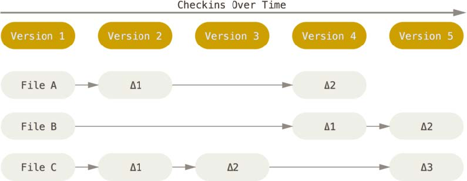
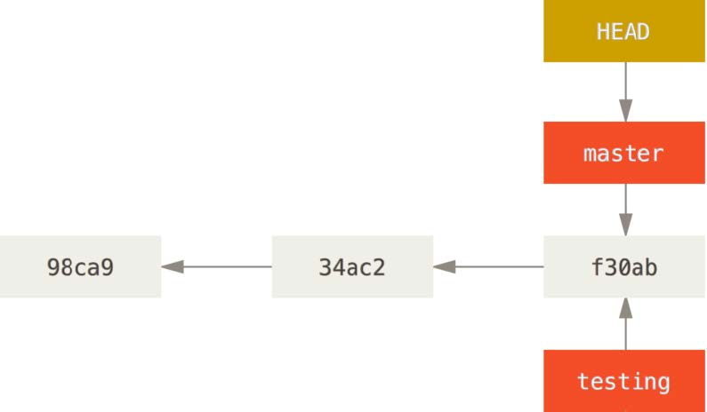

## Git

### 배경

#### 버전 관리 시스템 (Version Control System)

- **개요**
  - 파일의 변화를 시간에 따라 기록하여, 추후에 특정 시점의 버전을 다시 불러올 수 있는 시스템
- **사용처**
  - 프로젝트의 파일 혹은 프로젝트 전체를 이전 시점으로 되돌린다. 
  - 시간에 따른 수정 내용을 비교해볼 수 있다. 
  - 문제를 일으킨 사람을 찾아낼 수 있다. 
  - 이슈를 발행한 사람을 찾아낼 수 있다. 
  - 파일을 잃어버리거나, 잘못 수정하였을 때 복구할 수 있다. 
- **종류**
  - 로컬 버전 관리
  - 중앙집중식 버전 관리(CVCS)
  - *분산 버전 관리 시스템(DVCS)* - Git

#### Git의 주요 개념

- **데이터 처리 방식**

  - 델타 기반

    

  - 스냅샷

    

- **거의 대부분의 명령을 로컬 환경에서 실행**

  - 네트워크가 연결되지 않은 상황에서도 코드에 대한 작업이 가능

- **무결성 (Integrity)**

  - 데이터의 체크섬(Checksum)을 통해 무결성을 유지

- **세 가지 상태**

  - *Committed*, *Modified*, *Staged*

    

---

###사용법

#### Git 저장소 만들기

- Git에 의해 버전 관리가 이루어지는 디렉토리

1. `git init` 아직 버전 관리가 이루어지지 않는 디렉토리를 선택하여 Git 저장소를 적용한다. 
2. `git clone` 다른 어딘가에 존재하는 Git 저장소를 Clone한다. 
   - https://, git://, ... 등의 프로토콜을 지원한다. 

#### Git 저장소에 저장하기

- 작업 공간(Working Directory)에서 작업한 내용을 Git 저장소에 저장하는 것

1. `git add ...` *Untracked*, *Modified* 상태의 파일을 *Staged* 상태로 변경

   

2. `git commit -m "commit message"` *Staged* 상태의 파일을 *Committed* 상태로 변경

#### Git 저장소 상태 확인하기

- 현재 작업 공간(Working Directory)의 상태를 명령어를 통해 확인하는 것

1. `git status`

   ```shell
   $ git status
   On branch master
   Your branch is up-to-date with 'origin/master'.
   nothing to commit, working directory clean
   ```

2. `git status -s` 

   ```shell
   $ git status -s # 왼쪽이 Staging Area에서의 상태, 오른쪽이 Working Tree에서의 상태
    M README
   MM Rakefile
   A  lib/git.rb
   M  lib/simplegit.rb
   ?? LICENSE.txt
   ```

#### 파일 무시하기

- `.gitignore`
  - Git 저장소에서 무시할 파일의 패턴을 작성한다. 
  - 로그 파일, 빌드 시스템 혹은 IDE에서 자동으로 생성한 파일 등

#### 수정된 내용 확인하기

- `git diff` 
  - 작업 공간(Working Directory)과 스테이징 영역(Staging Area)의 차이를 보여준다. 
- `git diff --staged` 
  - 스테이징 영역(Staging Area)과 저장소의 차이를 보여준다. 

#### 커밋 히스토리 조회하기

- `git log` 
  - 현재 Git 저장소의 Commit 역사를 조회한다. 
- `git log -p` 
  - 각 Commit의 차이를 포함하여 조회한다. 
- `git log -2` 
  - 최근 두 개의 Commit을 조회한다. 

#### 되돌리기

- 저지른 실수를 대부분 되돌릴 수 있다. 
- 한 번 되돌릴 경우, 돌이킬 수 없다. 

#### 리모트 저장소

- 네트워크 어딘가에 존재하는 저장소
- `git remote -v` 
  - 리모트 저장소의 이름과 URL을 보여준다. 
- `git remote add <이름> <URL>` 
  - 현재 Git 저장소에 리모트 저장소를 추가한다. 
- `git fetch <이름>` 
  - 리모트 저장소에 있는 데이터를 가져온다. 
- `git pull <이름> <브랜치>` 
  - 리모트 저장소에 있는 데이터를 가져와, 브랜치에 병합(Merge)한다. 
- `git push <이름> <브랜치>` 
  - <브랜치>를 <이름> 리모트 저장소에 푸시한다. 
  - `git clone` 이후 아무도 리모트 저장소에 `git push`하지 않았을 경우 가능하다. 

---

### Git 브랜치

#### 브랜치란?

- 개발을 하다 보면 코드를 여러 개 복사해야 하는 일이 생긴다. 

- 코드 전체를 복사하고 난 이후에 기존 소스 코드와는 무관하게 **독립적으로 개발하는 것**을 브랜치라고 한다. 

- Git에서
  - 브랜치를 만들어서 작업하고, 나중에 Merge하는 방식을 권장한다. 
  - 브랜치 간 이동이 훨씬 자유롭다. (가볍고, 빠르게 이동할 수 있다. )
  - *HEAD* 포인터를 통해 현재 브랜치를 가리킨다. 

    

#### 새로운 브랜치 생성

- `git branch testing`

  - `testing` 브랜치를 새로 생성한다, 해당 브랜치는 지금 작업하고 있던 마지막 커밋을 가리킨다. 
  - *HEAD* 포인터는 새로 생성된 브랜치를 가리키지 않는다. 

- `git checkout testing`

  - *HEAD* 포인터가 `testing` 브랜치를 가리키는 것으로 바뀐다. 

- **흐름**

  `git checkout testing` 이후

  

  `testing` 브랜치에서 `git commit ...` 이후

  

  `git checkout master` 이후

  

  `master` 브랜치에서 `git commit ...` 이후

  

#### Merge

- 두 개의 브랜치를 통합한다. 

  - `master` 브랜치에 `testing` 브랜치를 통합시키고 싶을 경우
    - `git checkout master` 명령을 통해 `master` 브랜치로 이동
    - `git merge testing` 명령을 통해 `testing` 브랜치를 통합
    - `git branch -d testing` 명령을 통해 `testing` 브랜치를 삭제

- **branch 충돌**

  - 동일한 파일에서 작업을 진행하는 경우, `git merge` 명령 실행 시 충돌이 발생할 수 있다. 

    ```html
    <<<<<<< HEAD:index.html
    <div id="footer">contact : email.support@github.com</div>
    =======
    <div id="footer">
    please contact us at support@github.com
    </div>
    >>>>>>> testing:index.html
    ```

    - `<<<<<<<`, `=======`, `>>>>>>> `
      - 세 가지 기호를 통해 충돌 난 부분을 확인할 수 있다. 
      - `<<<<<<<` 아래 부분은 현재 작업 중인 브랜치의 내용
      - `=======` 아래 부분은 병합(merge)하고자 하는 브랜치의 내용
    - 충돌 해결 후
      - `git add`, `git commit` 명령을 통해 충돌을 해결한다. 

---

### 브랜치 워크플로 (Workflow)

#### Long-Running 브랜치

- `master` 브랜치 = 배포하였거나, 배포할 코드 (안정적인 코드)

- `develop` 브랜치 = 개발을 진행하고, 안정화하는 브랜치

  

#### 토픽 브랜치

- `topic` 브랜치 = 하나의 주제 혹은 작업을 위해 만든 브랜치
  - 하나의 이슈를 처리하기 위한 브랜치 등에 사용할 수 있다. 

---

### 참조

- http://git-scm.com/book/ko/v2